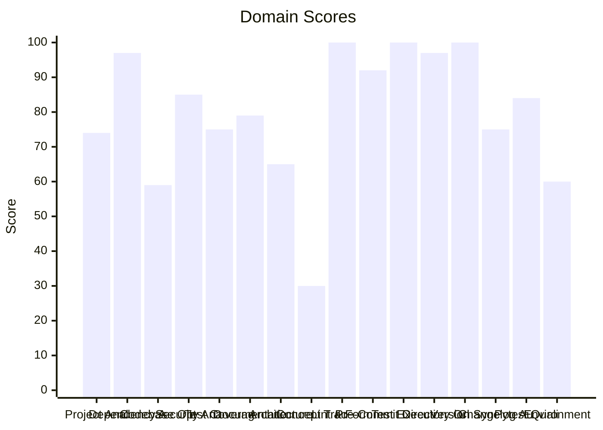

# 🔬 Code Enhancement Report

> **Generated**: 2026-05-22 22:13:55 UTC | **Target**: microsoft-agent | **Overall GPA**: 2.5/4.0

---

## 📊 Executive Summary

| Domain | Grade | Score | Status |
|--------|-------|-------|--------|
| Concept Traceability | 🔴 F | 30/100 | `██████░░░░░░░░░░░░░░` 30/100 |
| Codebase Optimization | 🔴 F | 59/100 | `███████████░░░░░░░░░` 59/100 |
| Environment Variables | 🟠 D | 60/100 | `████████████░░░░░░░░` 60/100 |
| Architecture & Design Patterns | 🟠 D | 65/100 | `█████████████░░░░░░░` 65/100 |
| Project Analysis | 🟡 C | 74/100 | `██████████████░░░░░░` 74/100 |
| Test Coverage | 🟡 C | 75/100 | `███████████████░░░░░` 75/100 |
| Changelog Audit | 🟡 C | 75/100 | `███████████████░░░░░` 75/100 |
| Documentation & Governance | 🟡 C | 79/100 | `███████████████░░░░░` 79/100 |
| Pytest Quality | 🔵 B | 84/100 | `████████████████░░░░` 84/100 |
| Security Analysis | 🔵 B | 85/100 | `█████████████████░░░` 85/100 |
| Pre-Commit Compliance | 🟢 A | 92/100 | `██████████████████░░` 92/100 |
| Dependency Audit | 🟢 A | 97/100 | `███████████████████░` 97/100 |
| Directory Organization | 🟢 A | 97/100 | `███████████████████░` 97/100 |
| Linting & Formatting | 🟢 A | 100/100 | `████████████████████` 100/100 |
| Test Execution | 🟢 A | 100/100 | `████████████████████` 100/100 |
| Version Sync Analysis | 🟢 A | 100/100 | `████████████████████` 100/100 |

---

## 📋 Domain Scorecards

### Project Analysis — 🟡 Grade: C (74/100)

`██████████████░░░░░░` 74/100

> [!NOTE]
> Detected ecosystem marker: agent-utilities → Agent-Utilities Ecosystem

| Criterion | Points | Evidence | Reasoning |
|-----------|--------|----------|-----------|
| has_pyproject | 10 | `pyproject.toml and requirements.txt` | Both pyproject.toml and requirements.txt exist, fulfilling mandatory Python proj |
| project_type_detected | 10 | `Agent-Utilities Ecosystem` | Identified 1 ecosystem marker(s) in dependencies |
| externalized_prompts | 0 | `/home/apps/workspace/agent-packages/agents/microsoft-agent` | No prompts/ directory found. Prompts may be hardcoded in source. |
| observability | 0 | `dependency list` | No observability tools (logfire, sentry, opentelemetry) found |
| testing_suite | 10 | `tests dir: True, pytest dep: True` | Tests directory exists, pytest in dependencies |
| agents_md | 10 | `/home/apps/workspace/agent-packages/agents/microsoft-agent/A` | AGENTS.md exists with comprehensive content |
| pre_commit_hooks | 10 | `/home/apps/workspace/agent-packages/agents/microsoft-agent/.` | Pre-commit configuration found for automated code quality checks |
| gitignore | 10 | `/home/apps/workspace/agent-packages/agents/microsoft-agent/.` | .gitignore exists to prevent committing build artifacts and secrets |
| env_template | 10 | `/home/apps/workspace/agent-packages/agents/microsoft-agent/.` | Environment template exists for onboarding and secret management |
| protocol_support | 4 | `MCP` | 1 communication protocol(s) detected |

**Findings:**
- Protocol support: MCP

---

### Dependency Audit — 🟢 Grade: A (97/100)

`███████████████████░` 97/100

> [!TIP]
> Minor update: msgraph-sdk 1.56.0 (installed) -> 1.58.0

| Criterion | Points | Evidence | Reasoning |
|-----------|--------|----------|-----------|
| dependency_freshness | 97 | `source=/home/apps/workspace/agent-packages/agents/microsoft-` | Audited 7 deps (7 installed, 0 constraint-only). 0 major, 1 minor, 0 patch update |

---

### Codebase Optimization — 🔴 Grade: F (59/100)

`███████████░░░░░░░░░` 59/100

> [!CAUTION]
> 24 functions exceed 50 lines

| Criterion | Points | Evidence | Reasoning |
|-----------|--------|----------|-----------|
| code_quality | 59 | `{"file_count": 31, "total_lines": 11648, "function_count": 4` | Analyzed 31 files, 419 functions. Avg CC=4.6, max length=161, duplication=1.5%,  |

**Findings:**
- Monolithic: mcp_server.py (1765L) — 7 functions with high complexity (worst: get_mcp_instance at 127L, CC=38); Low cohesion: 41 distinct concepts in one file
- Needs attention: api_client_other.py (2026L) — God class: MicrosoftGraphApiOther (82 methods) — consider mixins/composition
- Needs attention: api_client_apps.py (632L) — God class: MicrosoftGraphApiApps (22 methods) — consider mixins/composition
- Needs attention: api_client_directory.py (750L) — God class: MicrosoftGraphApiDirectory (28 methods) — consider mixins/composition

---

### Security Analysis — 🔵 Grade: B (85/100)

`█████████████████░░░` 85/100

> [!NOTE]
> 1 HIGH severity vulnerabilities found

| Criterion | Points | Evidence | Reasoning |
|-----------|--------|----------|-----------|
| security_posture | 85 | `high=1 med=0 low=0 attack_surface={"subprocess_calls": 0, "f` | Scanned 31 files. Found 1 security findings. High: -15pts, Med: -0pts, Low: -0pt |

---

### Test Coverage — 🟡 Grade: C (75/100)

`███████████████░░░░░` 75/100

> [!NOTE]
> Test suite lacks intent diversity (only one type)

| Criterion | Points | Evidence | Reasoning |
|-----------|--------|----------|-----------|
| test_coverage_quality | 75 | `{"test_file_count": 9, "test_count": 37, "source_file_count"` | 37 tests across 9 files. Ratio: 1.19. Intent: {'unit': 37}. 1 without assertions |

**Findings:**
- 23 potential doc-test drift items

---

### Documentation & Governance — 🟡 Grade: C (79/100)

`███████████████░░░░░` 79/100

> [!NOTE]
> README.md missing sections: installation

| Criterion | Points | Evidence | Reasoning |
|-----------|--------|----------|-----------|
| documentation_quality | 79 | `{"README.md": {"exists": true, "missing": ["installation"]},` | Audited 6 standard docs + docs/ directory. 1 broken references, 4 docs present.  |

**Findings:**
- README missing: Has a Table of Contents
- README missing: References /docs directory material

---

### Architecture & Design Patterns — 🟠 Grade: D (65/100)

`█████████████░░░░░░░` 65/100

> [!WARNING]
> SRP: 8 modules exceed 500 lines (god modules)

| Criterion | Points | Evidence | Reasoning |
|-----------|--------|----------|-----------|
| architecture_quality | 65 | `{"layers": 0, "di_ratio": 0.07, "solid_violations": 2}` | Analyzed 31 files. 0/5 architecture layers present, DI ratio: 7%, 2 SOLID violat |

**Findings:**
- SRP: 7 classes have >15 methods
- No discernible layer architecture (no domain/service/adapter separation)
- Low dependency injection ratio: 7%

---

### Concept Traceability — 🔴 Grade: F (30/100)

`██████░░░░░░░░░░░░░░` 30/100

> [!CAUTION]
> Low traceability ratio: 0% concepts fully traced

| Criterion | Points | Evidence | Reasoning |
|-----------|--------|----------|-----------|
| concept_traceability | 30 | `{"total_concepts": 5, "well_traced": 0, "orphans": 5, "drift` | 5 unique concepts found. 0 fully traced (code+docs+tests), 5 orphans, 0 drifted. |

**Findings:**
- 37 test functions missing concept markers
- 354 significant functions (>10 lines) missing concept markers in docstrings

---

### Linting & Formatting — 🟢 Grade: A (100/100)

`████████████████████` 100/100

> [!TIP]
> Total lint findings: 0 (high/error: 0, medium/warning: 0, low: 0)

| Criterion | Points | Evidence | Reasoning |
|-----------|--------|----------|-----------|
| lint_compliance | 100 | `ruff=0, bandit=0, mypy=0` | 0 total findings across 3 tools. High/error: -0pts, Med/warning: -0pts, Low: -0p |

---

### Pre-Commit Compliance — 🟢 Grade: A (92/100)

`██████████████████░░` 92/100

> [!TIP]
> 1/23 pre-commit hooks failed: don't commit to branch

| Criterion | Points | Evidence | Reasoning |
|-----------|--------|----------|-----------|
| precommit_compliance | 92 | `{"total_hooks": 23, "passed": 22, "failed": 1, "skipped": 0,` | Ran pre-commit with 23 hooks: 22 passed, 1 failed, 0 skipped. 1 potentially outd |

**Findings:**
- 1 hook(s) may be outdated: ruff-pre-commit

---

### Test Execution — 🟢 Grade: A (100/100)

`████████████████████` 100/100

| Criterion | Points | Evidence | Reasoning |
|-----------|--------|----------|-----------|
| test_execution | 100 | `{"frameworks_detected": 1, "total_passed": 37, "total_failed` | Executed 1 framework(s). 37 passed, 0 failed, 0 errors. Pass rate: 100%. |

---

### Directory Organization — 🟢 Grade: A (97/100)

`███████████████████░` 97/100

> [!TIP]
> 1 rogue/throwaway scripts detected (fix_*, validate_*, patch_*, etc.): scripts/validate_a2a_agent.py

| Criterion | Points | Evidence | Reasoning |
|-----------|--------|----------|-----------|
| directory_organization | 97 | `{"total_source_files": 55, "total_directories": 9, "max_dept` | 55 files across 9 directories. Max depth: 3, avg files/dir: 6.1. 0 crowded, 0 se |

---

### Version Sync Analysis — 🟢 Grade: A (100/100)

`████████████████████` 100/100

> [!TIP]
> All version '0.15.0' declarations appear to be tracked correctly.

| Criterion | Points | Evidence | Reasoning |
|-----------|--------|----------|-----------|
| bumpversion_exists | 20 | `/home/apps/workspace/agent-packages/agents/microsoft-agent/.` | .bumpversion.cfg found |
| current_version_defined | 20 | `0.15.0` | Current version tracked is 0.15.0 |
| files_tracked | 20 | `5 files tracked` | Found 5 files tracked in .bumpversion.cfg |
| version_drift_check | 40 | `0 drifted files` | No version drift detected in codebase files |

---

### Changelog Audit — 🟡 Grade: C (75/100)

`███████████████░░░░░` 75/100

> [!NOTE]
> CHANGELOG.md is missing — create one following Keep a Changelog format

| Criterion | Points | Evidence | Reasoning |
|-----------|--------|----------|-----------|
| changelog_quality | 75 | `{"exists": false, "parseable": false, "version_count": 0, "h` | CHANGELOG.md missing. 0 versions tracked. 0 dependency changelogs analyzed. |

**Findings:**
- CHANGELOG.md is missing

---

### Pytest Quality — 🔵 Grade: B (84/100)

`████████████████░░░░` 84/100

> [!NOTE]
> Test directory lacks subdirectory organization (consider unit/, integration/, e2e/)

| Criterion | Points | Evidence | Reasoning |
|-----------|--------|----------|-----------|
| pytest_quality | 84 | `{"test_files": 9, "total_tests": 37, "descriptive_name_ratio` | 37 tests across 9 files. Naming: 20/20, Structure: 15/20, Fixtures: 11/20, Assert |

**Findings:**
- Missing conftest.py for shared fixtures
- No @pytest.mark.parametrize usage — consider data-driven tests
- No shared fixtures in conftest.py
- 1 tests have no assertions

---

### Environment Variables — 🟠 Grade: D (60/100)

`████████████░░░░░░░░` 60/100

> [!WARNING]
> Only 9% of env vars documented in README.md

| Criterion | Points | Evidence | Reasoning |
|-----------|--------|----------|-----------|
| env_var_documentation | 60 | `{"total_vars": 75, "python_vars": 43, "dockerfile_vars": 22,` | Found 75 unique env vars across 164 occurrences. README documents 7/75. Has .env |

**Findings:**
- Undocumented env vars: ADMINTOOL, AGREEMENTSTOOL, ALLOWED_CLIENT_REDIRECT_URIS, APPLICATIONSTOOL, AUDIENCE, AUDITTOOL, AUTHTOOL, AUTH_TYPE, CALENDARTOOL, CHATTOOL
- 7 Python env vars not in .env.example: AUDIENCE, DELEGATED_SCOPES, MICROSOFT_ENDPOINTS_JSON, MICROSOFT_TOKEN, OIDC_CLIENT_ID

---

## 🎯 Prioritized Action Items

| # | Priority | Domain | Action | Impact | Risk |
|---|----------|--------|--------|--------|------|
| 1 | 🔴 High | Codebase Optimization | 24 functions exceed 50 lines | High | High |
| 2 | 🔴 High | Codebase Optimization | Monolithic: mcp_server.py (1765L) — 7 functions with high complexity (worst: get | High | High |
| 3 | 🔴 High | Codebase Optimization | Needs attention: api_client_other.py (2026L) — God class: MicrosoftGraphApiOther | High | High |
| 4 | 🔴 High | Codebase Optimization | Needs attention: api_client_apps.py (632L) — God class: MicrosoftGraphApiApps (2 | High | High |
| 5 | 🔴 High | Codebase Optimization | Needs attention: api_client_directory.py (750L) — God class: MicrosoftGraphApiDi | High | High |
| 6 | 🔴 High | Codebase Optimization | 6 functions with nesting depth >4 | High | High |
| 7 | 🔴 High | Concept Traceability | Low traceability ratio: 0% concepts fully traced | High | High |
| 8 | 🔴 High | Concept Traceability | 37 test functions missing concept markers | High | High |
| 9 | 🔴 High | Concept Traceability | 354 significant functions (>10 lines) missing concept markers in docstrings | High | High |
| 10 | 🔴 High | Architecture & Design Patterns | SRP: 8 modules exceed 500 lines (god modules) | High | Medium |
| 11 | 🔴 High | Architecture & Design Patterns | SRP: 7 classes have >15 methods | High | Medium |
| 12 | 🔴 High | Architecture & Design Patterns | No discernible layer architecture (no domain/service/adapter separation) | High | Medium |
| 13 | 🔴 High | Architecture & Design Patterns | Low dependency injection ratio: 7% | High | Medium |
| 14 | 🔴 High | Environment Variables | Only 9% of env vars documented in README.md | High | Medium |
| 15 | 🔴 High | Environment Variables | Undocumented env vars: ADMINTOOL, AGREEMENTSTOOL, ALLOWED_CLIENT_REDIRECT_URIS,  | High | Medium |
| 16 | 🔴 High | Environment Variables | 7 Python env vars not in .env.example: AUDIENCE, DELEGATED_SCOPES, MICROSOFT_END | High | Medium |
| 17 | 🟡 Medium | Project Analysis | Detected ecosystem marker: agent-utilities → Agent-Utilities Ecosystem | Medium | Low |
| 18 | 🟡 Medium | Project Analysis | Protocol support: MCP | Medium | Low |
| 19 | 🟡 Medium | Test Coverage | Test suite lacks intent diversity (only one type) | Medium | Low |
| 20 | 🟡 Medium | Test Coverage | 23 potential doc-test drift items | Medium | Low |
| 21 | 🟡 Medium | Documentation & Governance | README.md missing sections: installation | Medium | Low |
| 22 | 🟡 Medium | Documentation & Governance | README missing: Has a Table of Contents | Medium | Low |
| 23 | 🟡 Medium | Documentation & Governance | README missing: References /docs directory material | Medium | Low |
| 24 | 🟡 Medium | Changelog Audit | CHANGELOG.md is missing — create one following Keep a Changelog format | Medium | Low |
| 25 | 🟡 Medium | Changelog Audit | CHANGELOG.md is missing | Medium | Low |
| 26 | 🟢 Low | Security Analysis | 1 HIGH severity vulnerabilities found | Low | Low |
| 27 | 🟢 Low | Pytest Quality | Test directory lacks subdirectory organization (consider unit/, integration/, e2 | Low | Low |
| 28 | 🟢 Low | Pytest Quality | Missing conftest.py for shared fixtures | Low | Low |
| 29 | 🟢 Low | Pytest Quality | No @pytest.mark.parametrize usage — consider data-driven tests | Low | Low |
| 30 | 🟢 Low | Pytest Quality | No shared fixtures in conftest.py | Low | Low |

---

## 🔄 SDD Handoff

Run `generate_sdd_handoff.py` with this report's JSON data to produce
structured TODO items compatible with the `spec-generator` → `task-planner` →
`sdd-implementer` pipeline. Output will be saved to `.specify/specs/`.
