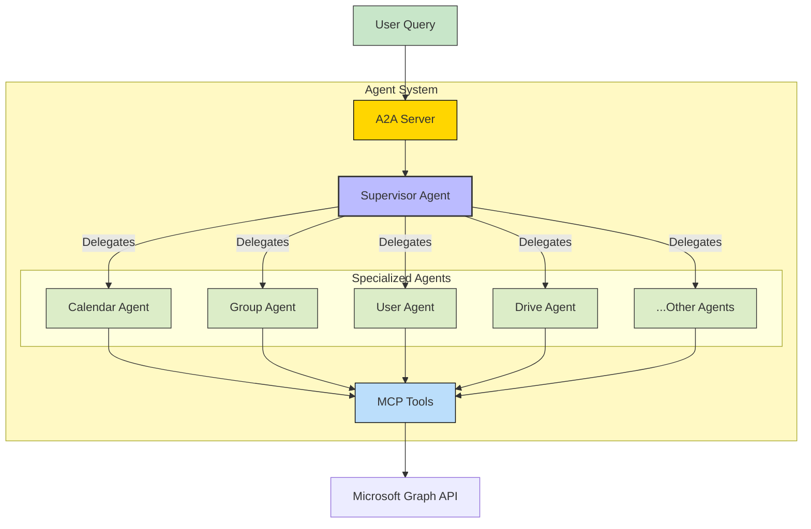
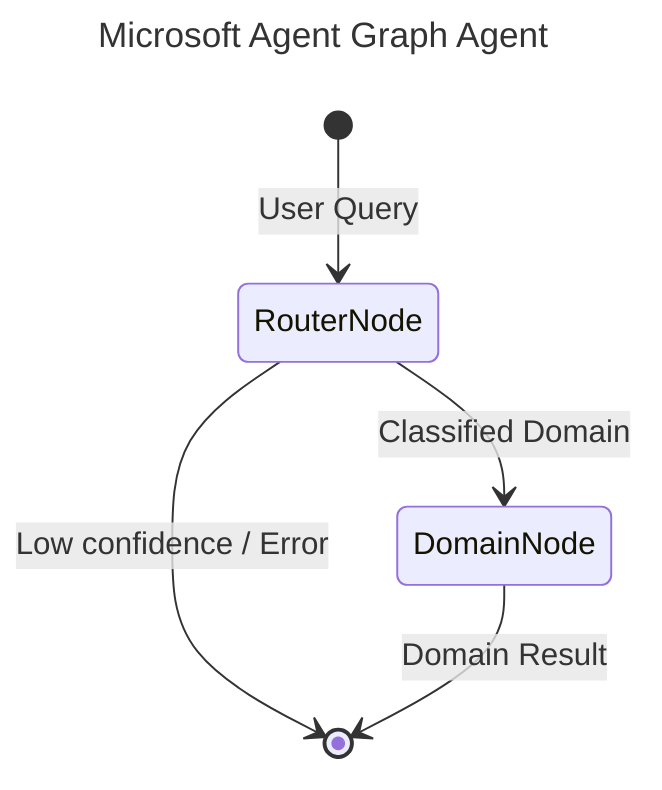

# Microsoft Agent - A2A | AG-UI | MCP


*Version: 0.17.0*

## Table of Contents
- [Overview](#overview)
- [Installation](#installation)
- [Environment Variables](#environment-variables)
- [MCP Server Setup](#mcp)
- [A2A Agent Architecture](#a2a-agent)
- [Security & Governance](#security--governance)
- [Docker Deployment](#docker)
- [Documentation & Guides](#documentation--guides)

## Overview

Microsoft Graph MCP Server + A2A Supervisor Agent

It includes a Model Context Protocol (MCP) server that wraps the Microsoft Graph API and an out-of-the-box Agent2Agent (A2A) Supervisor Agent.

Manage your Microsoft 365 tenant (Users, Groups, Calendars, Drive, etc.) through natural language!

This repository is actively maintained - Contributions are welcome!

### Capabilities:
- **Comprehensive Graph API Coverage**: Access thousands of Microsoft Graph endpoints via MCP tools.
- **Supervisor-Worker Agent Architecture**: A smart supervisor delegates tasks to specialized agents (e.g., Calendar Agent, User Agent).
- **Secure Authentication**: Supports OAuth, OIDC, and other authentication methods.

## Installation

To install the Python package:

```bash
pip install microsoft-agent
# or using uv:
uv pip install microsoft-agent
```

## Environment Variables

The following environment variables configure the behavior of the Microsoft Agent:

### Microsoft Graph API & MSAL

| Variable | Description | Default / Example | Required |
|----------|-------------|-------------------|----------|
| `MICROSOFT_HOST` | The base URL of the Microsoft Graph API endpoint. | `https://graph.microsoft.com` | Yes |
| `MICROSOFT_CLIENT_ID` | Microsoft Azure AD Application Client ID. | `your_microsoft_client_id_here` | Yes |
| `MICROSOFT_CLIENT_SECRET` | Microsoft Azure AD Application Client Secret. | `your_microsoft_client_secret_here` | Yes |
| `MICROSOFT_SCOPE` | Default authorization scope. | `https://graph.microsoft.com/.default` | No |
| `MICROSOFT_GRANT_TYPE` | Standard OAuth grant type. | `client_credentials` | No |
| `MICROSOFT_TOKEN` | Direct user access bearer token fallback. | `your_user_bearer_token_here` | No |

### OIDC & Secure JWT Verification (Multi-Agent A2A)

| Variable | Description | Default / Example | Required |
|----------|-------------|-------------------|----------|
| `AUTH_TYPE` | Active A2A authentication middleware strategy. | `oidc` (or `none`) | No |
| `OIDC_CLIENT_ID` | Client ID registering this agent in OIDC Provider. | `your_oidc_client_id_here` | No |
| `OIDC_CLIENT_SECRET` | Client Secret registering this agent in OIDC Provider. | `your_oidc_client_secret_here` | No |
| `OIDC_CONFIG_URL` | OpenID configuration endpoint. | `https://identity-provider/.well-known/openid-configuration` | No |
| `OIDC_BASE_URL` | Base URL of OIDC provider. | `https://identity-provider/` | No |
| `TOKEN_ISSUER` | Expected JWT issuer claim. | `https://identity-provider/` | No |
| `TOKEN_AUDIENCE` | Expected JWT audience claim. | `your_api_audience_here` | No |
| `TOKEN_JWKS_URI` | JWKS URI for token key signature validation. | `https://identity-provider/.well-known/jwks.json` | No |
| `ALLOWED_CLIENT_REDIRECT_URIS` | Allowed client redirect URI list (comma-separated). | `http://localhost:8000/callback` | No |

### Multi-Agent Eunomia Policies & Observability

| Variable | Description | Default / Example | Required |
|----------|-------------|-------------------|----------|
| `ENABLE_OTEL` | Enable OpenTelemetry logging, metrics, and tracing. | `false` | No |
| `OTEL_EXPORTER_OTLP_ENDPOINT` | OTLP telemetry exporter server endpoint. | `http://localhost:4318` | No |
| `OTEL_EXPORTER_OTLP_PROTOCOL` | OTLP exporter protocol. | `http/protobuf` | No |
| `LLM_API_KEY` | Model API key for dynamic agent routing. | `your_llm_api_key_here` | No |
| `LLM_BASE_URL` | Base endpoint of target LLM service. | `https://api.openai.com/v1` | No |
| `EUNOMIA_TYPE` | Tool authorization policy manager type. | `local` (or `remote`) | No |
| `EUNOMIA_POLICY_FILE` | Path to Eunomia role-based authorization policy file. | `policy.yaml` | No |
| `EUNOMIA_REMOTE_URL` | Remote Central Eunomia policy server endpoint. | `http://localhost:8080/policy` | No |

## MCP

### Available MCP Tools

This server utilizes dynamic Action-Routed tools to optimize token overhead and maximize IDE compatibility.

| Tool Name | Description |
|-----------|-------------|
| `msgraph_admin` | Consolidated Action-Routed tool for admin. Methods: list_service_health, get_service_health, list_service_health_issues, get_service_health_issue, list_service_update_messages, get_service_update_message, get_admin_sharepoint, update_admin_sharepoint, list_delegated_admin_relationships, get_delegated_admin_relationship |
| `msgraph_agreements` | Consolidated Action-Routed tool for agreements. Methods: list_agreements, get_agreement, create_agreement, delete_agreement |
| `msgraph_applications` | Consolidated Action-Routed tool for applications. Methods: list_applications, get_application, create_application, update_application, delete_application, add_application_password, remove_application_password, list_service_principals, get_service_principal, create_service_principal, update_service_principal, delete_service_principal |
| `msgraph_audit` | Consolidated Action-Routed tool for audit. Methods: list_directory_audits, get_directory_audit, list_sign_in_logs, get_sign_in_log, list_provisioning_logs |
| `msgraph_auth` | Consolidated Action-Routed tool for auth. Methods: login, logout, verify_login, list_accounts |
| `msgraph_calendar` | Consolidated Action-Routed tool for calendar. Methods: list_calendar_events, get_calendar_event, create_calendar_event, update_calendar_event, delete_calendar_event, list_specific_calendar_events, get_specific_calendar_event, create_specific_calendar_event, update_specific_calendar_event, delete_specific_calendar_event, get_calendar_view, list_calendars, find_meeting_times |
| `msgraph_chat` | Consolidated Action-Routed tool for chat. Methods: get_chat |
| `msgraph_communications` | Consolidated Action-Routed tool for communications. Methods: list_online_meetings, get_online_meeting, create_online_meeting, update_online_meeting, delete_online_meeting, list_call_records, get_call_record, list_presences, get_presence, get_my_presence |
| `msgraph_connections` | Consolidated Action-Routed tool for connections. Methods: list_external_connections, get_external_connection, create_external_connection, delete_external_connection |
| `msgraph_contacts` | Consolidated Action-Routed tool for contacts. Methods: get_outlook_contact, create_outlook_contact, update_outlook_contact, delete_outlook_contact |
| `msgraph_devices` | Consolidated Action-Routed tool for devices. Methods: list_devices, get_device, delete_device, list_managed_devices, get_managed_device, list_device_compliance_policies, list_device_configurations, wipe_managed_device, retire_managed_device |
| `msgraph_directory` | Consolidated Action-Routed tool for directory. Methods: list_directory_objects, get_directory_object, list_directory_roles, get_directory_role, list_directory_role_templates, list_deleted_items, restore_deleted_item, list_role_definitions, get_role_definition, list_role_assignments, get_role_assignment, create_role_assignment |
| `msgraph_domains` | Consolidated Action-Routed tool for domains. Methods: list_domains, get_domain, create_domain, delete_domain, verify_domain, list_domain_service_configuration_records |
| `msgraph_education` | Consolidated Action-Routed tool for education. Methods: list_education_classes, get_education_class, list_education_schools, get_education_school, list_education_users, list_education_assignments |
| `msgraph_employee_experience` | Consolidated Action-Routed tool for employee_experience. Methods: list_learning_providers, get_learning_provider, list_learning_course_activities |
| `msgraph_files` | Consolidated Action-Routed tool for files. Methods: list_users, list_drives, get_drive_root_item, download_onedrive_file_content, delete_onedrive_file, upload_file_content, create_excel_chart, format_excel_range, sort_excel_range, get_excel_range, list_excel_worksheets, list_excel_tables, get_excel_workbook, list_onenote_notebooks, list_onenote_notebook_sections, list_onenote_section_pages, list_todo_task_lists, list_todo_tasks, list_planner_tasks, list_plan_tasks, list_outlook_contacts, list_chats, get_excel_worksheet, list_joined_teams, list_team_channels, list_team_members, list_site_drives, get_site_drive_by_id, list_site_items, get_site_item, list_site_lists, get_site_list, list_sharepoint_site_list_items, get_sharepoint_site_list_item, get_excel_table |
| `msgraph_groups` | Consolidated Action-Routed tool for groups. Methods: list_groups, get_group, create_group, update_group, delete_group, list_group_members, add_group_member, remove_group_member, list_group_owners, list_group_conversations, list_group_drives |
| `msgraph_identity` | Consolidated Action-Routed tool for identity. Methods: create_invitation, list_conditional_access_policies, get_conditional_access_policy, create_conditional_access_policy, update_conditional_access_policy, delete_conditional_access_policy, list_access_reviews, get_access_review, list_entitlement_access_packages, list_lifecycle_workflows |
| `msgraph_mail` | Consolidated Action-Routed tool for mail. Methods: list_mail_messages, list_mail_folders, list_mail_folder_messages, get_mail_message, send_mail, list_shared_mailbox_messages, list_shared_mailbox_folder_messages, get_shared_mailbox_message, send_shared_mailbox_mail, create_draft_email, delete_mail_message, move_mail_message, update_mail_message, add_mail_attachment, list_mail_attachments, get_mail_attachment, delete_mail_attachment, get_root_folder, list_folder_files, list_chat_messages, get_chat_message, send_chat_message, list_channel_messages, get_channel_message, send_channel_message, list_chat_message_replies, reply_to_chat_message |
| `msgraph_meta` | Consolidated Action-Routed tool for meta. Methods: searches |
| `msgraph_notes` | Consolidated Action-Routed tool for notes. Methods: get_onenote_page_content, create_onenote_page |
| `msgraph_organization` | Consolidated Action-Routed tool for organization. Methods: list_organization, get_organization, update_organization, get_org_branding, update_org_branding |
| `msgraph_places` | Consolidated Action-Routed tool for places. Methods: list_rooms, list_room_lists, get_place, update_place |
| `msgraph_policies` | Consolidated Action-Routed tool for policies. Methods: get_authorization_policy, list_token_lifetime_policies, list_token_issuance_policies, list_permission_grant_policies, get_admin_consent_policy |
| `msgraph_print` | Consolidated Action-Routed tool for print. Methods: list_printers, get_printer, list_print_jobs, create_print_job, list_print_shares |
| `msgraph_privacy` | Consolidated Action-Routed tool for privacy. Methods: list_subject_rights_requests, get_subject_rights_request, create_subject_rights_request |
| `msgraph_reports` | Consolidated Action-Routed tool for reports. Methods: get_email_activity_report, get_mailbox_usage_report, get_office365_active_users, get_sharepoint_activity_report, get_teams_user_activity, get_onedrive_usage_report |
| `msgraph_search` | Consolidated Action-Routed tool for search. Methods: search_query |
| `msgraph_security` | Consolidated Action-Routed tool for security. Methods: list_security_alerts, get_security_alert, update_security_alert, list_security_incidents, get_security_incident, update_security_incident, list_secure_scores, list_threat_intelligence_hosts, get_threat_intelligence_host, run_hunting_query, list_risk_detections, get_risk_detection, list_risky_users, get_risky_user, dismiss_risky_user, list_sensitivity_labels, get_sensitivity_label |
| `msgraph_sites` | Consolidated Action-Routed tool for sites. Methods: list_sites, get_site, get_sharepoint_site_by_path, get_sharepoint_sites_delta |
| `msgraph_solutions` | Consolidated Action-Routed tool for solutions. Methods: list_booking_businesses, get_booking_business, list_booking_appointments, create_booking_appointment, list_virtual_events |
| `msgraph_storage` | Consolidated Action-Routed tool for storage. Methods: list_file_storage_containers, get_file_storage_container, create_file_storage_container |
| `msgraph_subscriptions` | Consolidated Action-Routed tool for subscriptions. Methods: list_subscriptions, get_subscription, create_subscription, update_subscription, delete_subscription |
| `msgraph_tasks` | Consolidated Action-Routed tool for tasks. Methods: get_todo_task, create_todo_task, update_todo_task, delete_todo_task, get_planner_plan, get_planner_task, create_planner_task, update_planner_task, update_planner_task_details |
| `msgraph_teams` | Consolidated Action-Routed tool for teams. Methods: get_team, get_team_channel |
| `msgraph_user` | Consolidated Action-Routed tool for user. Methods: get_current_user, get_me |


---

### Dynamic Tool Selection & Visibility

This MCP server supports dynamic toolset selection and visibility filtering at runtime. This allows you to restrict the set of exposed tools in order to prevent blowing up the LLM's context window.

You can configure tool filtering via multiple input channels:

- **CLI Arguments:** Pass `--tools` or `--toolsets` (or their disabled counterparts `--disabled-tools` and `--disabled-toolsets`) during startup.
- **Environment Variables:** Define standard environment variables:
  - `MCP_ENABLED_TOOLS` / `MCP_DISABLED_TOOLS`
  - `MCP_ENABLED_TAGS` / `MCP_DISABLED_TAGS`
- **HTTP SSE Request Headers:** Pass custom headers during transport initialization:
  - `x-mcp-enabled-tools` / `x-mcp-disabled-tools`
  - `x-mcp-enabled-tags` / `x-mcp-disabled-tags`
- **HTTP SSE Request Query Parameters:** Append query parameters directly to your transport connection URL:
  - `?tools=tool1,tool2`
  - `?tags=tag1`

When query strings or parameters are supplied, an LLM-free **Knowledge Graph resolution layer** (using `DynamicToolOrchestrator`) matches query intents against known tool tags, names, or descriptions, with safe fallback and automated 24-hour background cache refreshing.


## A2A Agent

This package includes a powerful A2A Supervisor Agent that orchestrates interaction with the Microsoft MCP tools.

### Architecture

The system uses a Supervisor Agent that analyzes user requests and delegates them to domain-specific Child Agents.



### Component Interaction

1. **User** sends a request (e.g., "Schedule a meeting with the Engineering team").
2. **Supervisor Agent** identifies this as a calendar and group task.
3. **Supervisor** delegates finding the group members to the **Group Agent**.
4. **Group Agent** calls `list_members_group` tool and returns emails.
5. **Supervisor** delegates scheduling to the **Calendar Agent** with the retrieved emails.
6. **Calendar Agent** calls `post_events` tool.
7. **Supervisor** confirms completion to the User.


## Graph Architecture

This agent uses `pydantic-graph` orchestration for intelligent routing and optimal context management.



- **RouterNode**: A fast, lightweight LLM (e.g., `nvidia/nemotron-3-super`) that classifies the user's query into one of the specialized domains.
- **DomainNode**: The executor node. For the selected domain, it dynamically sets environment variables to temporarily enable ONLY the tools relevant to that domain, creating a highly focused sub-agent (e.g., `gpt-4o`) to complete the request. This preserves LLM context and prevents tool hallucination.

## Usage

### MCP CLI

| Short Flag | Long Flag                          | Description                                                                 |
|------------|------------------------------------|-----------------------------------------------------------------------------|
| -h         | --help                             | Display help information                                                    |
| -t         | --transport                        | Transport method: 'stdio', 'http', or 'sse' [legacy] (default: stdio)       |
| -s         | --host                             | Host address for HTTP transport (default: 0.0.0.0)                          |
| -p         | --port                             | Port number for HTTP transport (default: 8000)                              |
|            | --auth-type                        | Auth type: 'none', 'static', 'jwt', 'oauth-proxy', 'oidc-proxy' (default: none) |
|            | ...                                | (See standard FastMCP auth flags)                                           |

### A2A CLI

#### Endpoints
- **Web UI**: `http://localhost:9000/` (if enabled)
- **A2A**: `http://localhost:9000/a2a` (Discovery: `/a2a/.well-known/agent.json`)
- **AG-UI**: `http://localhost:9000/ag-ui` (POST)

| Argument          | Description                                                    | Default                        |
|-------------------|----------------------------------------------------------------|--------------------------------|
| `--host`          | Host to bind the server to                                     | `0.0.0.0`                      |
| `--port`          | Port to bind the server to                                     | `9000`                         |
| `--provider`      | LLM Provider (openai, anthropic, google, huggingface)          | `openai`                       |
| `--model-id`      | LLM Model ID                                                   | `nvidia/nemotron-3-super`           |
| `--mcp-url`       | MCP Server URL                                                 | `http://microsoft-agent:8000/mcp` |

### Examples

#### Run A2A Server
```bash
microsoft-agent-server --provider openai --model-id gpt-4o --api-key sk-... --mcp-url http://localhost:8000/mcp
```

## Security & Governance

This project is built on [`agent-utilities`](https://github.com/Knuckles-Team/agent-utilities), inheriting enterprise-grade security and governance features.

### Authentication & Authorization
| Feature | Description |
|---------|-------------|
| **OIDC Token Delegation** | RFC 8693 token exchange for user-context propagation from A2A → MCP |
| **Eunomia Policies** | Fine-grained, policy-driven tool authorization (`none`, `embedded`, `remote`) |
| **Scoped Credentials** | Tools execute with the caller's scoped identity where possible |
| **3LO / OAuth / API Token** | Multiple auth strategies with graceful fallback |

### Eunomia Policy Enforcement
Eunomia provides a policy enforcement point for all tool calls:
- **Embedded mode**: Load local `mcp_policies.json` for role-based access, sensitivity gating, and audit logging
- **Remote mode**: Forward authorization decisions to a central Eunomia policy server for multi-agent governance
- Enable via CLI: `--eunomia-type embedded --eunomia-policy-file mcp_policies.json`

### Runtime Protections
| Protection | Description |
|------------|-------------|
| **Tool Guard** | Sensitivity detection with human-in-the-loop approval gating |
| **Prompt Injection Defense** | Input scanning and repetition/loop guards |
| **Content Filtering** | Output schema enforcement and cost budget controls |
| **Stuck Loop Detection** | Automatic detection and recovery from agent loops |
| **Context Limit Warnings** | Proactive alerts before context window exhaustion |

### Graph Agent Architecture
The A2A agent uses `pydantic-graph` orchestration with:
- **RouterNode**: Lightweight classifier that routes queries to specialized domains
- **DomainNode**: Focused executor with only relevant tools loaded, preventing tool hallucination
- **Approval Gates**: Policy-driven approval workflows before sensitive operations
- **Usage Guards**: Budget and rate limiting enforcement

> **Production Recommendation**: Enable `--eunomia-type embedded` (or `remote`) + OIDC delegation + containerized deployment. See [`agent-utilities` documentation](https://github.com/Knuckles-Team/agent-utilities) for full policy configuration.

## Docker

### Build

```bash
docker build -t microsoft-agent .
```

### Run MCP Server

```bash
docker run -p 8000:8000 microsoft-agent
```

### Run Agent Server

```bash
docker run -e CMD=agent-server -p 9000:9000 microsoft-agent
```

### Deploy as a Service

```bash
docker pull knucklessg1/microsoft-agent:latest

docker run -d \
  --name microsoft-agent \
  -p 8000:8000 \
  -e HOST=0.0.0.0 \
  -e PORT=8000 \
  -e TRANSPORT=http \
  knucklessg1/microsoft-agent:latest
```

## Documentation & Guides

For more detailed technical documentation and deployment guides, please check out our [/docs](file:///home/apps/workspace/agent-packages/agents/microsoft-agent/docs) directory:
- [Overview Guide](file:///home/apps/workspace/agent-packages/agents/microsoft-agent/docs/overview.md) - High-level conceptual registry and ecosystem mapping.

## Repository Owners


Documentation:

[Microsoft API Docs](https://learn.microsoft.com/en-us/graph/api/resources/mail-api-overview?view=graph-rest-1.0)
[Microsoft Graph SDK](https://github.com/microsoftgraph/msgraph-sdk-python)


## MCP Configuration Examples

### stdio (recommended for local development)
```json
{
  "mcpServers": {
    "microsoft": {
      "command": ".venv/bin/microsoft-mcp",
      "args": [],
      "env": {
        "MICROSOFT_CLIENT_ID": "",
        "MICROSOFT_CLIENT_SECRET": "",
        "MICROSOFT_TENANT_ID": ""
}
    }
  }
}
```

### Streamable HTTP (recommended for production)
```json
{
  "mcpServers": {
    "microsoft": {
      "url": "http://localhost:8080/microsoft-mcp/mcp"
    }
  }
}
```


### Available MCP Tools
| Tool Module | Toggle Env Var | Enabled by Default | Description & Nested Methods |
|-------------|----------------|--------------------|------------------------------|
| **Auth** | `AUTH_TOOL` | `True` | Manage microsoft auth operations. Action-routed methods: `list_accounts`, `login`, `logout`, `verify_login`. |
| **Meta** | `META_TOOL` | `True` | Manage microsoft meta operations. Action-routed methods: `searches`. |
| **Mail** | `MAIL_TOOL` | `True` | Manage microsoft mail operations. Action-routed methods: `add_mail_attachment`, `create_draft_email`, `delete_mail_attachment`, `delete_mail_message`, `get_channel_message`, `get_chat_message`, `get_mail_attachment`, `get_mail_message`, `get_root_folder`, `get_shared_mailbox_message`, `list_channel_messages`, `list_chat_message_replies`, `list_chat_messages`, `list_folder_files`, `list_mail_attachments`, `list_mail_folder_messages`, `list_mail_folders`, `list_mail_messages`, `list_shared_mailbox_folder_messages`, `list_shared_mailbox_messages`, `move_mail_message`, `reply_to_chat_message`, `send_channel_message`, `send_chat_message`, `send_mail`, `send_shared_mailbox_mail`, `update_mail_message`. |
| **Files** | `FILES_TOOL` | `True` | Manage microsoft files operations. Action-routed methods: `create_excel_chart`, `delete_onedrive_file`, `download_onedrive_file_content`, `format_excel_range`, `get_drive_root_item`, `get_excel_range`, `get_excel_table`, `get_excel_workbook`, `get_excel_worksheet`, `get_sharepoint_site_list_item`, `get_site_drive_by_id`, `get_site_item`, `get_site_list`, `list_chats`, `list_drives`, `list_excel_tables`, `list_excel_worksheets`, `list_joined_teams`, `list_onenote_notebook_sections`, `list_onenote_notebooks`, `list_onenote_section_pages`, `list_outlook_contacts`, `list_plan_tasks`, `list_planner_tasks`, `list_sharepoint_site_list_items`, `list_site_drives`, `list_site_items`, `list_site_lists`, `list_team_channels`, `list_team_members`, `list_todo_task_lists`, `list_todo_tasks`, `list_users`, `sort_excel_range`, `upload_file_content`. |
| **Calendar** | `CALENDAR_TOOL` | `True` | Manage microsoft calendar operations. Action-routed methods: `create_calendar_event`, `create_specific_calendar_event`, `delete_calendar_event`, `delete_specific_calendar_event`, `find_meeting_times`, `get_calendar_event`, `get_calendar_view`, `get_specific_calendar_event`, `list_calendar_events`, `list_calendars`, `list_specific_calendar_events`, `update_calendar_event`, `update_specific_calendar_event`. |
| **Notes** | `NOTES_TOOL` | `True` | Manage microsoft notes operations. Action-routed methods: `create_onenote_page`, `get_onenote_page_content`. |
| **Tasks** | `TASKS_TOOL` | `True` | Manage microsoft tasks operations. Action-routed methods: `create_planner_task`, `create_todo_task`, `delete_todo_task`, `get_planner_plan`, `get_planner_task`, `get_todo_task`, `update_planner_task`, `update_planner_task_details`, `update_todo_task`. |
| **Contacts** | `CONTACTS_TOOL` | `True` | Manage microsoft contacts operations. Action-routed methods: `create_outlook_contact`, `delete_outlook_contact`, `get_outlook_contact`, `update_outlook_contact`. |
| **User** | `USER_TOOL` | `True` | Manage microsoft user operations. Action-routed methods: `get_current_user`, `get_me`. |
| **Chat** | `CHAT_TOOL` | `True` | Manage microsoft chat operations. Action-routed methods: `get_chat`. |
| **Teams** | `TEAMS_TOOL` | `True` | Manage microsoft teams operations. Action-routed methods: `get_team`, `get_team_channel`. |
| **Sites** | `SITES_TOOL` | `True` | Manage microsoft sites operations. Action-routed methods: `get_sharepoint_site_by_path`, `get_sharepoint_sites_delta`, `get_site`, `list_sites`. |
| **Search** | `SEARCH_TOOL` | `True` | Manage microsoft search operations. Action-routed methods: `search_query`, `search_tools`. |
| **Groups** | `GROUPS_TOOL` | `True` | Manage microsoft groups operations. Action-routed methods: `add_group_member`, `create_group`, `delete_group`, `get_group`, `list_group_conversations`, `list_group_drives`, `list_group_members`, `list_group_owners`, `list_groups`, `remove_group_member`, `update_group`. |
| **Admin** | `ADMIN_TOOL` | `True` | Manage microsoft admin operations. Action-routed methods: `get_admin_sharepoint`, `get_delegated_admin_relationship`, `get_service_health`, `get_service_health_issue`, `get_service_update_message`, `list_delegated_admin_relationships`, `list_service_health`, `list_service_health_issues`, `list_service_update_messages`, `update_admin_sharepoint`. |
| **Organization** | `ORGANIZATION_TOOL` | `True` | Manage microsoft organization operations. Action-routed methods: `get_org_branding`, `get_organization`, `list_organization`, `update_org_branding`, `update_organization`. |
| **Domains** | `DOMAINS_TOOL` | `True` | Manage microsoft domains operations. Action-routed methods: `create_domain`, `delete_domain`, `get_domain`, `list_domain_service_configuration_records`, `list_domains`, `verify_domain`. |
| **Subscriptions** | `SUBSCRIPTIONS_TOOL` | `True` | Manage microsoft subscriptions operations. Action-routed methods: `create_subscription`, `delete_subscription`, `get_subscription`, `list_subscriptions`, `update_subscription`. |
| **Communications** | `COMMUNICATIONS_TOOL` | `True` | Manage microsoft communications operations. Action-routed methods: `create_online_meeting`, `delete_online_meeting`, `get_call_record`, `get_my_presence`, `get_online_meeting`, `get_presence`, `list_call_records`, `list_online_meetings`, `list_presences`, `update_online_meeting`. |
| **Identity** | `IDENTITY_TOOL` | `True` | Manage microsoft identity operations. Action-routed methods: `create_conditional_access_policy`, `create_invitation`, `delete_conditional_access_policy`, `get_access_review`, `get_conditional_access_policy`, `list_access_reviews`, `list_conditional_access_policies`, `list_entitlement_access_packages`, `list_lifecycle_workflows`, `update_conditional_access_policy`. |
| **Security** | `SECURITY_TOOL` | `True` | Manage microsoft security operations. Action-routed methods: `dismiss_risky_user`, `get_risk_detection`, `get_risky_user`, `get_security_alert`, `get_security_incident`, `get_sensitivity_label`, `get_threat_intelligence_host`, `list_risk_detections`, `list_risky_users`, `list_secure_scores`, `list_security_alerts`, `list_security_incidents`, `list_sensitivity_labels`, `list_threat_intelligence_hosts`, `run_hunting_query`, `update_security_alert`, `update_security_incident`. |
| **Audit** | `AUDIT_TOOL` | `True` | Manage microsoft audit operations. Action-routed methods: `get_directory_audit`, `get_sign_in_log`, `list_directory_audits`, `list_provisioning_logs`, `list_sign_in_logs`. |
| **Reports** | `REPORTS_TOOL` | `True` | Manage microsoft reports operations. Action-routed methods: `get_email_activity_report`, `get_mailbox_usage_report`, `get_office365_active_users`, `get_onedrive_usage_report`, `get_sharepoint_activity_report`, `get_teams_user_activity`. |
| **Applications** | `APPLICATIONS_TOOL` | `True` | Manage microsoft applications operations. Action-routed methods: `add_application_password`, `create_application`, `create_service_principal`, `delete_application`, `delete_service_principal`, `get_application`, `get_service_principal`, `list_applications`, `list_service_principals`, `remove_application_password`, `update_application`, `update_service_principal`. |
| **Directory** | `DIRECTORY_TOOL` | `True` | Manage microsoft directory operations. Action-routed methods: `create_role_assignment`, `get_directory_object`, `get_directory_role`, `get_role_assignment`, `get_role_definition`, `list_deleted_items`, `list_directory_objects`, `list_directory_role_templates`, `list_directory_roles`, `list_role_assignments`, `list_role_definitions`, `restore_deleted_item`. |
| **Policies** | `POLICIES_TOOL` | `True` | Manage microsoft policies operations. Action-routed methods: `get_admin_consent_policy`, `get_authorization_policy`, `list_permission_grant_policies`, `list_token_issuance_policies`, `list_token_lifetime_policies`. |
| **Devices** | `DEVICES_TOOL` | `True` | Manage microsoft devices operations. Action-routed methods: `delete_device`, `get_device`, `get_managed_device`, `list_device_compliance_policies`, `list_device_configurations`, `list_devices`, `list_managed_devices`, `retire_managed_device`, `wipe_managed_device`. |
| **Education** | `EDUCATION_TOOL` | `True` | Manage microsoft education operations. Action-routed methods: `get_education_class`, `get_education_school`, `list_education_assignments`, `list_education_classes`, `list_education_schools`, `list_education_users`. |
| **Agreements** | `AGREEMENTS_TOOL` | `True` | Manage microsoft agreements operations. Action-routed methods: `create_agreement`, `delete_agreement`, `get_agreement`, `list_agreements`. |
| **Places** | `PLACES_TOOL` | `True` | Manage microsoft places operations. Action-routed methods: `get_place`, `list_room_lists`, `list_rooms`, `update_place`. |
| **Print** | `PRINT_TOOL` | `True` | Manage microsoft print operations. Action-routed methods: `create_print_job`, `get_printer`, `list_print_jobs`, `list_print_shares`, `list_printers`. |
| **Privacy** | `PRIVACY_TOOL` | `True` | Manage microsoft privacy operations. Action-routed methods: `create_subject_rights_request`, `get_subject_rights_request`, `list_subject_rights_requests`. |
| **Solutions** | `SOLUTIONS_TOOL` | `True` | Manage microsoft solutions operations. Action-routed methods: `create_booking_appointment`, `get_booking_business`, `list_booking_appointments`, `list_booking_businesses`, `list_virtual_events`. |
| **Storage** | `STORAGE_TOOL` | `True` | Manage microsoft storage operations. Action-routed methods: `create_file_storage_container`, `get_file_storage_container`, `list_file_storage_containers`. |
| **Employee Experience** | `EMPLOYEE_EXPERIENCE_TOOL` | `True` | Manage microsoft employee experience operations. Action-routed methods: `get_learning_provider`, `list_learning_course_activities`, `list_learning_providers`. |
| **Connections** | `CONNECTIONS_TOOL` | `True` | Manage microsoft connections operations. Action-routed methods: `create_external_connection`, `delete_external_connection`, `get_external_connection`, `list_external_connections`. |
