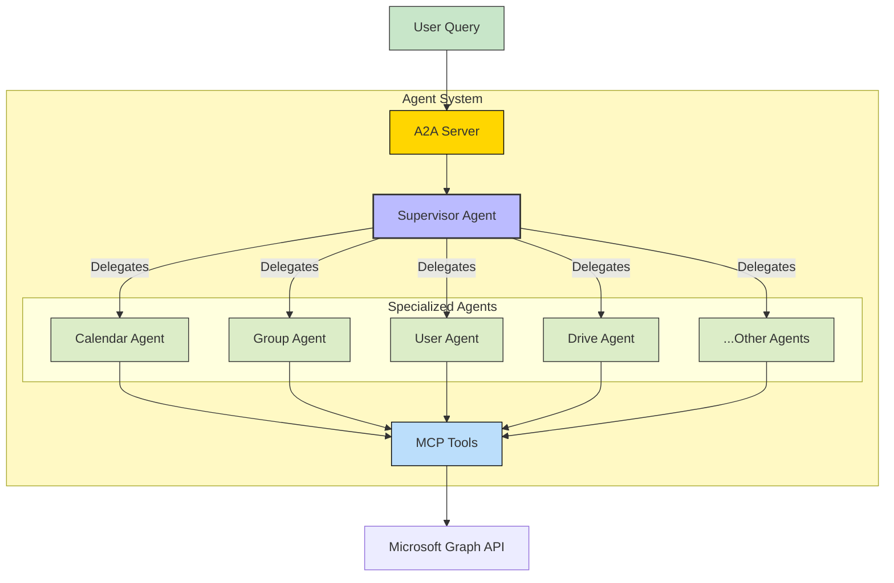
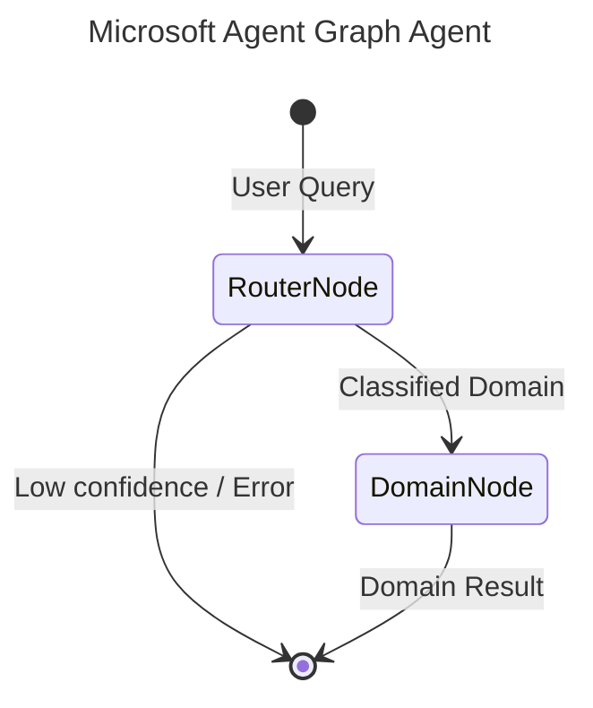

# Microsoft Agent - A2A | AG-UI | MCP


*Version: 0.15.0*

## Overview

Microsoft Graph MCP Server + A2A Supervisor Agent

It includes a Model Context Protocol (MCP) server that wraps the Microsoft Graph API and an out-of-the-box Agent2Agent (A2A) Supervisor Agent.

Manage your Microsoft 365 tenant (Users, Groups, Calendars, Drive, etc.) through natural language!

This repository is actively maintained - Contributions are welcome!

### Capabilities:
- **Comprehensive Graph API Coverage**: Access thousands of Microsoft Graph endpoints via MCP tools.
- **Supervisor-Worker Agent Architecture**: A smart supervisor delegates tasks to specialized agents (e.g., Calendar Agent, User Agent).
- **Secure Authentication**: Supports OAuth, OIDC, and other authentication methods.

## MCP

### Available MCP Tools

This server utilizes dynamic Action-Routed tools to optimize token overhead and maximize IDE compatibility.

| Tool Name | Description |
|-----------|-------------|
| `msgraph_admin` | Consolidated Action-Routed tool for admin. Methods: list_service_health, get_service_health, list_service_health_issues, get_service_health_issue, list_service_update_messages, get_service_update_message, get_admin_sharepoint, update_admin_sharepoint, list_delegated_admin_relationships, get_delegated_admin_relationship |
| `msgraph_agreements` | Consolidated Action-Routed tool for agreements. Methods: list_agreements, get_agreement, create_agreement, delete_agreement |
| `msgraph_applications` | Consolidated Action-Routed tool for applications. Methods: list_applications, get_application, create_application, update_application, delete_application, add_application_password, remove_application_password, list_service_principals, get_service_principal, create_service_principal, update_service_principal, delete_service_principal |
| `msgraph_audit` | Consolidated Action-Routed tool for audit. Methods: list_directory_audits, get_directory_audit, list_sign_in_logs, get_sign_in_log, list_provisioning_logs |
| `msgraph_auth` | Consolidated Action-Routed tool for auth. Methods: login, logout, verify_login, list_accounts |
| `msgraph_calendar` | Consolidated Action-Routed tool for calendar. Methods: list_calendar_events, get_calendar_event, create_calendar_event, update_calendar_event, delete_calendar_event, list_specific_calendar_events, get_specific_calendar_event, create_specific_calendar_event, update_specific_calendar_event, delete_specific_calendar_event, get_calendar_view, list_calendars, find_meeting_times |
| `msgraph_chat` | Consolidated Action-Routed tool for chat. Methods: get_chat |
| `msgraph_communications` | Consolidated Action-Routed tool for communications. Methods: list_online_meetings, get_online_meeting, create_online_meeting, update_online_meeting, delete_online_meeting, list_call_records, get_call_record, list_presences, get_presence, get_my_presence |
| `msgraph_connections` | Consolidated Action-Routed tool for connections. Methods: list_external_connections, get_external_connection, create_external_connection, delete_external_connection |
| `msgraph_contacts` | Consolidated Action-Routed tool for contacts. Methods: get_outlook_contact, create_outlook_contact, update_outlook_contact, delete_outlook_contact |
| `msgraph_devices` | Consolidated Action-Routed tool for devices. Methods: list_devices, get_device, delete_device, list_managed_devices, get_managed_device, list_device_compliance_policies, list_device_configurations, wipe_managed_device, retire_managed_device |
| `msgraph_directory` | Consolidated Action-Routed tool for directory. Methods: list_directory_objects, get_directory_object, list_directory_roles, get_directory_role, list_directory_role_templates, list_deleted_items, restore_deleted_item, list_role_definitions, get_role_definition, list_role_assignments, get_role_assignment, create_role_assignment |
| `msgraph_domains` | Consolidated Action-Routed tool for domains. Methods: list_domains, get_domain, create_domain, delete_domain, verify_domain, list_domain_service_configuration_records |
| `msgraph_education` | Consolidated Action-Routed tool for education. Methods: list_education_classes, get_education_class, list_education_schools, get_education_school, list_education_users, list_education_assignments |
| `msgraph_employee_experience` | Consolidated Action-Routed tool for employee_experience. Methods: list_learning_providers, get_learning_provider, list_learning_course_activities |
| `msgraph_files` | Consolidated Action-Routed tool for files. Methods: list_users, list_drives, get_drive_root_item, download_onedrive_file_content, delete_onedrive_file, upload_file_content, create_excel_chart, format_excel_range, sort_excel_range, get_excel_range, list_excel_worksheets, list_excel_tables, get_excel_workbook, list_onenote_notebooks, list_onenote_notebook_sections, list_onenote_section_pages, list_todo_task_lists, list_todo_tasks, list_planner_tasks, list_plan_tasks, list_outlook_contacts, list_chats, get_excel_worksheet, list_joined_teams, list_team_channels, list_team_members, list_site_drives, get_site_drive_by_id, list_site_items, get_site_item, list_site_lists, get_site_list, list_sharepoint_site_list_items, get_sharepoint_site_list_item, get_excel_table |
| `msgraph_groups` | Consolidated Action-Routed tool for groups. Methods: list_groups, get_group, create_group, update_group, delete_group, list_group_members, add_group_member, remove_group_member, list_group_owners, list_group_conversations, list_group_drives |
| `msgraph_identity` | Consolidated Action-Routed tool for identity. Methods: create_invitation, list_conditional_access_policies, get_conditional_access_policy, create_conditional_access_policy, update_conditional_access_policy, delete_conditional_access_policy, list_access_reviews, get_access_review, list_entitlement_access_packages, list_lifecycle_workflows |
| `msgraph_mail` | Consolidated Action-Routed tool for mail. Methods: list_mail_messages, list_mail_folders, list_mail_folder_messages, get_mail_message, send_mail, list_shared_mailbox_messages, list_shared_mailbox_folder_messages, get_shared_mailbox_message, send_shared_mailbox_mail, create_draft_email, delete_mail_message, move_mail_message, update_mail_message, add_mail_attachment, list_mail_attachments, get_mail_attachment, delete_mail_attachment, get_root_folder, list_folder_files, list_chat_messages, get_chat_message, send_chat_message, list_channel_messages, get_channel_message, send_channel_message, list_chat_message_replies, reply_to_chat_message |
| `msgraph_meta` | Consolidated Action-Routed tool for meta. Methods: searches |
| `msgraph_notes` | Consolidated Action-Routed tool for notes. Methods: get_onenote_page_content, create_onenote_page |
| `msgraph_organization` | Consolidated Action-Routed tool for organization. Methods: list_organization, get_organization, update_organization, get_org_branding, update_org_branding |
| `msgraph_places` | Consolidated Action-Routed tool for places. Methods: list_rooms, list_room_lists, get_place, update_place |
| `msgraph_policies` | Consolidated Action-Routed tool for policies. Methods: get_authorization_policy, list_token_lifetime_policies, list_token_issuance_policies, list_permission_grant_policies, get_admin_consent_policy |
| `msgraph_print` | Consolidated Action-Routed tool for print. Methods: list_printers, get_printer, list_print_jobs, create_print_job, list_print_shares |
| `msgraph_privacy` | Consolidated Action-Routed tool for privacy. Methods: list_subject_rights_requests, get_subject_rights_request, create_subject_rights_request |
| `msgraph_reports` | Consolidated Action-Routed tool for reports. Methods: get_email_activity_report, get_mailbox_usage_report, get_office365_active_users, get_sharepoint_activity_report, get_teams_user_activity, get_onedrive_usage_report |
| `msgraph_search` | Consolidated Action-Routed tool for search. Methods: search_query |
| `msgraph_security` | Consolidated Action-Routed tool for security. Methods: list_security_alerts, get_security_alert, update_security_alert, list_security_incidents, get_security_incident, update_security_incident, list_secure_scores, list_threat_intelligence_hosts, get_threat_intelligence_host, run_hunting_query, list_risk_detections, get_risk_detection, list_risky_users, get_risky_user, dismiss_risky_user, list_sensitivity_labels, get_sensitivity_label |
| `msgraph_sites` | Consolidated Action-Routed tool for sites. Methods: list_sites, get_site, get_sharepoint_site_by_path, get_sharepoint_sites_delta |
| `msgraph_solutions` | Consolidated Action-Routed tool for solutions. Methods: list_booking_businesses, get_booking_business, list_booking_appointments, create_booking_appointment, list_virtual_events |
| `msgraph_storage` | Consolidated Action-Routed tool for storage. Methods: list_file_storage_containers, get_file_storage_container, create_file_storage_container |
| `msgraph_subscriptions` | Consolidated Action-Routed tool for subscriptions. Methods: list_subscriptions, get_subscription, create_subscription, update_subscription, delete_subscription |
| `msgraph_tasks` | Consolidated Action-Routed tool for tasks. Methods: get_todo_task, create_todo_task, update_todo_task, delete_todo_task, get_planner_plan, get_planner_task, create_planner_task, update_planner_task, update_planner_task_details |
| `msgraph_teams` | Consolidated Action-Routed tool for teams. Methods: get_team, get_team_channel |
| `msgraph_user` | Consolidated Action-Routed tool for user. Methods: get_current_user, get_me |

## A2A Agent

This package includes a powerful A2A Supervisor Agent that orchestrates interaction with the Microsoft MCP tools.

### Architecture

The system uses a Supervisor Agent that analyzes user requests and delegates them to domain-specific Child Agents.



### Component Interaction

1. **User** sends a request (e.g., "Schedule a meeting with the Engineering team").
2. **Supervisor Agent** identifies this as a calendar and group task.
3. **Supervisor** delegates finding the group members to the **Group Agent**.
4. **Group Agent** calls `list_members_group` tool and returns emails.
5. **Supervisor** delegates scheduling to the **Calendar Agent** with the retrieved emails.
6. **Calendar Agent** calls `post_events` tool.
7. **Supervisor** confirms completion to the User.


## Graph Architecture

This agent uses `pydantic-graph` orchestration for intelligent routing and optimal context management.



- **RouterNode**: A fast, lightweight LLM (e.g., `nvidia/nemotron-3-super`) that classifies the user's query into one of the specialized domains.
- **DomainNode**: The executor node. For the selected domain, it dynamically sets environment variables to temporarily enable ONLY the tools relevant to that domain, creating a highly focused sub-agent (e.g., `gpt-4o`) to complete the request. This preserves LLM context and prevents tool hallucination.

## Usage

### MCP CLI

| Short Flag | Long Flag                          | Description                                                                 |
|------------|------------------------------------|-----------------------------------------------------------------------------|
| -h         | --help                             | Display help information                                                    |
| -t         | --transport                        | Transport method: 'stdio', 'http', or 'sse' [legacy] (default: stdio)       |
| -s         | --host                             | Host address for HTTP transport (default: 0.0.0.0)                          |
| -p         | --port                             | Port number for HTTP transport (default: 8000)                              |
|            | --auth-type                        | Auth type: 'none', 'static', 'jwt', 'oauth-proxy', 'oidc-proxy' (default: none) |
|            | ...                                | (See standard FastMCP auth flags)                                           |

### A2A CLI

#### Endpoints
- **Web UI**: `http://localhost:9000/` (if enabled)
- **A2A**: `http://localhost:9000/a2a` (Discovery: `/a2a/.well-known/agent.json`)
- **AG-UI**: `http://localhost:9000/ag-ui` (POST)

| Argument          | Description                                                    | Default                        |
|-------------------|----------------------------------------------------------------|--------------------------------|
| `--host`          | Host to bind the server to                                     | `0.0.0.0`                      |
| `--port`          | Port to bind the server to                                     | `9000`                         |
| `--provider`      | LLM Provider (openai, anthropic, google, huggingface)          | `openai`                       |
| `--model-id`      | LLM Model ID                                                   | `nvidia/nemotron-3-super`           |
| `--mcp-url`       | MCP Server URL                                                 | `http://microsoft-agent:8000/mcp` |

### Examples

#### Run A2A Server
```bash
microsoft-agent-server --provider openai --model-id gpt-4o --api-key sk-... --mcp-url http://localhost:8000/mcp
```

## Security & Governance

This project is built on [`agent-utilities`](https://github.com/Knuckles-Team/agent-utilities), inheriting enterprise-grade security and governance features.

### Authentication & Authorization
| Feature | Description |
|---------|-------------|
| **OIDC Token Delegation** | RFC 8693 token exchange for user-context propagation from A2A → MCP |
| **Eunomia Policies** | Fine-grained, policy-driven tool authorization (`none`, `embedded`, `remote`) |
| **Scoped Credentials** | Tools execute with the caller's scoped identity where possible |
| **3LO / OAuth / API Token** | Multiple auth strategies with graceful fallback |

### Eunomia Policy Enforcement
Eunomia provides a policy enforcement point for all tool calls:
- **Embedded mode**: Load local `mcp_policies.json` for role-based access, sensitivity gating, and audit logging
- **Remote mode**: Forward authorization decisions to a central Eunomia policy server for multi-agent governance
- Enable via CLI: `--eunomia-type embedded --eunomia-policy-file mcp_policies.json`

### Runtime Protections
| Protection | Description |
|------------|-------------|
| **Tool Guard** | Sensitivity detection with human-in-the-loop approval gating |
| **Prompt Injection Defense** | Input scanning and repetition/loop guards |
| **Content Filtering** | Output schema enforcement and cost budget controls |
| **Stuck Loop Detection** | Automatic detection and recovery from agent loops |
| **Context Limit Warnings** | Proactive alerts before context window exhaustion |

### Graph Agent Architecture
The A2A agent uses `pydantic-graph` orchestration with:
- **RouterNode**: Lightweight classifier that routes queries to specialized domains
- **DomainNode**: Focused executor with only relevant tools loaded, preventing tool hallucination
- **Approval Gates**: Policy-driven approval workflows before sensitive operations
- **Usage Guards**: Budget and rate limiting enforcement

> **Production Recommendation**: Enable `--eunomia-type embedded` (or `remote`) + OIDC delegation + containerized deployment. See [`agent-utilities` documentation](https://github.com/Knuckles-Team/agent-utilities) for full policy configuration.

## Docker

### Build

```bash
docker build -t microsoft-agent .
```

### Run MCP Server

```bash
docker run -p 8000:8000 microsoft-agent
```

### Run Agent Server

```bash
docker run -e CMD=agent-server -p 9000:9000 microsoft-agent
```

### Deploy as a Service

```bash
docker pull knucklessg1/microsoft-agent:latest

docker run -d \
  --name microsoft-agent \
  -p 8000:8000 \
  -e HOST=0.0.0.0 \
  -e PORT=8000 \
  -e TRANSPORT=http \
  knucklessg1/microsoft-agent:latest
```

## Install Python Package

```bash
python -m pip install microsoft-agent
```
```bash
uv pip install microsoft-agent
```

## Repository Owners


Documentation:

[Microsoft API Docs](https://learn.microsoft.com/en-us/graph/api/resources/mail-api-overview?view=graph-rest-1.0)
[Microsoft Graph SDK](https://github.com/microsoftgraph/msgraph-sdk-python)


## MCP Configuration Examples

### stdio (recommended for local development)
```json
{
  "mcpServers": {
    "microsoft": {
      "command": ".venv/bin/microsoft-mcp",
      "args": [],
      "env": {
        "MICROSOFT_CLIENT_ID": "",
        "MICROSOFT_CLIENT_SECRET": "",
        "MICROSOFT_TENANT_ID": ""
}
    }
  }
}
```

### Streamable HTTP (recommended for production)
```json
{
  "mcpServers": {
    "microsoft": {
      "url": "http://localhost:8080/microsoft-mcp/mcp"
    }
  }
}
```
