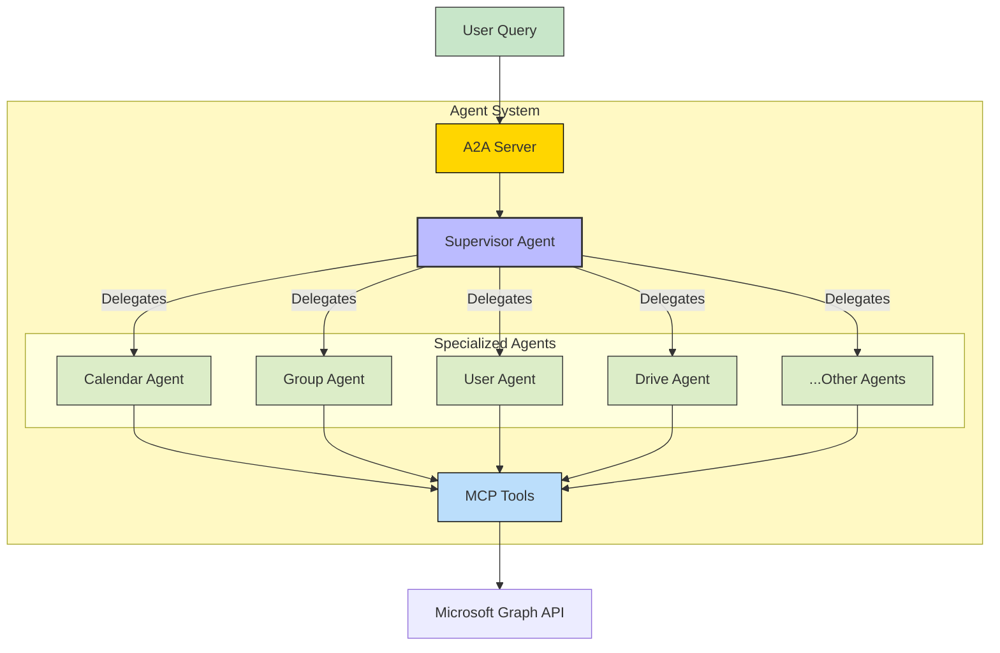
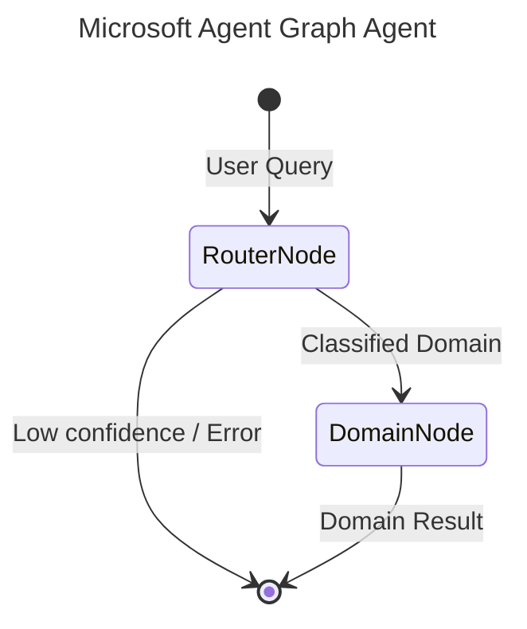

# Microsoft Agent - A2A | AG-UI | MCP


*Version: 1.0.1*

> **Documentation** — Installation, deployment, usage across the API, CLI, MCP, and
> A2A interfaces, and guidance for configuring the Microsoft Graph connection are
> maintained in the [official documentation](https://knuckles-team.github.io/microsoft-agent/).

## Table of Contents
- [Overview](#overview)
- [Installation](#installation)
- [Environment Variables](#environment-variables)
- [MCP Server Setup](#mcp)
- [A2A Agent Architecture](#a2a-agent)
- [Security & Governance](#security--governance)
- [Docker Deployment](#docker)
- [Documentation](#documentation)

## Overview

Microsoft Graph MCP Server + A2A Supervisor Agent

It includes a Model Context Protocol (MCP) server that wraps the Microsoft Graph API and an out-of-the-box Agent2Agent (A2A) Supervisor Agent.

Manage your Microsoft 365 tenant (Users, Groups, Calendars, Drive, etc.) through natural language!

This repository is actively maintained - Contributions are welcome!

### Capabilities:
- **Comprehensive Graph API Coverage**: Access thousands of Microsoft Graph endpoints via MCP tools.
- **Supervisor-Worker Agent Architecture**: A smart supervisor delegates tasks to specialized agents (e.g., Calendar Agent, User Agent).
- **Secure Authentication**: Supports OAuth, OIDC, and other authentication methods.

## Installation

Pick the extra that matches what you want to run:

| Extra | Installs | Use when |
|-------|----------|----------|
| `microsoft-agent[mcp]` | Slim MCP server only (`agent-utilities[mcp]` — FastMCP/FastAPI) | You only run the **MCP server** (smallest install / image) |
| `microsoft-agent[agent]` | Full agent runtime (`agent-utilities[agent,logfire]` — Pydantic AI + the epistemic-graph engine) | You run the **integrated A2A agent** |
| `microsoft-agent[all]` | Everything (`mcp` + `agent` + `logfire`) | Development / both surfaces |

```bash
# MCP server only (recommended for tool hosting — slim deps)
uv pip install "microsoft-agent[mcp]"

# Full agent runtime (Pydantic AI + epistemic-graph engine)
uv pip install "microsoft-agent[agent]"

# Everything (development)
uv pip install "microsoft-agent[all]"      # or: python -m pip install "microsoft-agent[all]"
```

### Container images (`:mcp` vs `:agent`)

One multi-stage `docker/Dockerfile` builds two right-sized images, selected by `--target`:

| Image tag | Build target | Contents | Entrypoint |
|-----------|--------------|----------|------------|
| `knucklessg1/microsoft-agent:mcp` | `--target mcp` | `microsoft-agent[mcp]` — **slim**, no engine/`pydantic-ai`/`dspy`/`llama-index`/`tree-sitter` | `microsoft-mcp` |
| `knucklessg1/microsoft-agent:latest` | `--target agent` (default) | `microsoft-agent[agent]` — **full** agent runtime + epistemic-graph engine | `microsoft-agent` |

```bash
docker build --target mcp   -t knucklessg1/microsoft-agent:mcp    docker/   # slim MCP server
docker build --target agent -t knucklessg1/microsoft-agent:latest docker/   # full agent
```

`docker/mcp.compose.yml` runs the slim `:mcp` server; `docker/compose.yml` runs the
agent (`:latest`).

### Knowledge-graph database (`epistemic-graph`)

The **full agent** (`[agent]` / `:latest`) embeds the **epistemic-graph** engine (pulled in
transitively via `agent-utilities[agent]`). For production — or to share one knowledge graph
across multiple agents — run **epistemic-graph as its own database container** and point the
agent at it instead of embedding it. Deployment recipes (single-node + Raft HA), connection
config, and the full database architecture (with diagrams) are documented in the
[epistemic-graph deployment guide](https://knuckles-team.github.io/epistemic-graph/deployment/).
The slim `[mcp]` server does **not** require the database.

## Environment Variables

<!-- ENV-VARS-TABLE:START -->

#### Package environment variables

| Variable | Example | Description |
|----------|---------|-------------|
| `MICROSOFT_ENDPOINTS_JSON` | `./endpoints.json` | Path to a JSON file describing the Microsoft Graph endpoints to expose: |
| `MICROSOFT_TOKEN` | `your_user_bearer_token_here` | If using direct user access tokens instead of MSAL / client credentials: |
| `AUDIENCE` | `https://graph.microsoft.com` | Audience for OIDC delegated token exchange (outbound Graph token): |
| `AUTH_TYPE` | `oidc` | OIDC / JWT Verification Settings (A2A Secure Authentication) |
| `OIDC_CLIENT_ID` | `your_oidc_client_id_here` |  |
| `OIDC_CLIENT_SECRET` | `your_oidc_client_secret_here` |  |
| `OIDC_CONFIG_URL` | `https://your-identity-provider/.well-known/openid-configuration` |  |
| `OIDC_BASE_URL` | `https://your-identity-provider/` |  |
| `TESTING` | — | Set to disable live auth manager creation during tests: |
| `USER` | `user` | OS user (used for credential cache namespacing); usually inherited from shell: |
| `XDG_DATA_HOME` | — | Override XDG data home for the MSAL token cache location: |
| `ENABLE_OTEL` | `false` | Multi-Agent and Observability Options |
| `OTEL_EXPORTER_OTLP_ENDPOINT` | `http://localhost:4318` |  |
| `OTEL_EXPORTER_OTLP_PROTOCOL` | `http/protobuf` |  |
| `LLM_API_KEY` | `your_llm_api_key_here` | LLM Config (for agent-utilities integration) |
| `LLM_BASE_URL` | `https://api.openai.com/v1` |  |
| `EUNOMIA_TYPE` | `local` | Eunomia Security Policy Config |
| `EUNOMIA_POLICY_FILE` | `policy.yaml` |  |
| `EUNOMIA_REMOTE_URL` | `http://localhost:8080/policy` |  |
| `ADMINTOOL` | `true` | MCP Tool Enabling Configuration (True/False) |
| `AGREEMENTSTOOL` | `true` |  |
| `APPLICATIONSTOOL` | `true` |  |
| `AUDITTOOL` | `true` |  |
| `AUTHTOOL` | `true` |  |
| `CALENDARTOOL` | `true` |  |
| `CHATTOOL` | `true` |  |
| `COMMUNICATIONSTOOL` | `true` |  |
| `CONNECTIONSTOOL` | `true` |  |
| `CONTACTSTOOL` | `true` |  |
| `DELEGATED_SCOPES` | `true` |  |
| `DEVICESTOOL` | `true` |  |
| `DIRECTORYTOOL` | `true` |  |
| `DOMAINSTOOL` | `true` |  |
| `EDUCATIONTOOL` | `true` |  |
| `EMPLOYEE_EXPERIENCETOOL` | `true` |  |
| `FILESTOOL` | `true` |  |
| `GROUPSTOOL` | `true` |  |
| `IDENTITYTOOL` | `true` |  |
| `MAILTOOL` | `true` |  |
| `METATOOL` | `true` |  |
| `NOTESTOOL` | `true` |  |
| `ORGANIZATIONTOOL` | `true` |  |
| `PLACESTOOL` | `true` |  |
| `POLICIESTOOL` | `true` |  |
| `PRINTTOOL` | `true` |  |
| `PRIVACYTOOL` | `true` |  |
| `REPORTSTOOL` | `true` |  |
| `SEARCHTOOL` | `true` |  |
| `SECURITYTOOL` | `true` |  |
| `SITESTOOL` | `true` |  |
| `SOLUTIONSTOOL` | `true` |  |
| `STORAGETOOL` | `true` |  |
| `SUBSCRIPTIONSTOOL` | `true` |  |
| `TASKSTOOL` | `true` |  |
| `TEAMSTOOL` | `true` |  |
| `USERTOOL` | `true` |  |

#### Inherited agent-utilities variables (apply to every connector)

| Variable | Example | Description |
|----------|---------|-------------|
| `TRANSPORT` | `stdio` | MCP transport: `stdio` | `streamable-http` | `sse` |
| `HOST` | `0.0.0.0` | Bind host (HTTP transports) |
| `PORT` | `8000` | Bind port (HTTP transports) |
| `MCP_TOOL_MODE` | `condensed` | Tool surface: `condensed` | `verbose` | `both` |
| `MCP_ENABLED_TOOLS` | — | Comma-separated tool allow-list |
| `MCP_DISABLED_TOOLS` | — | Comma-separated tool deny-list |
| `MCP_ENABLED_TAGS` | — | Comma-separated tag allow-list |
| `MCP_DISABLED_TAGS` | — | Comma-separated tag deny-list |
| `MCP_CLIENT_AUTH` | — | Outbound MCP auth (`oidc-client-credentials` for fleet calls) |
| `DEBUG` | `False` | Verbose logging |
| `PYTHONUNBUFFERED` | `1` | Unbuffered stdout (recommended in containers) |
| `MCP_URL` | `http://localhost:8000/mcp` | URL of the MCP server the agent connects to |
| `PROVIDER` | `openai` | LLM provider for the agent |
| `MODEL_ID` | `gpt-4o` | Model id for the agent |
| `ENABLE_WEB_UI` | `True` | Serve the AG-UI web interface |

_56 package + 15 inherited variable(s). Auto-generated from `.env.example` + the shared agent-utilities set — do not edit._
<!-- ENV-VARS-TABLE:END -->


The following environment variables configure the behavior of the Microsoft Agent:

### Microsoft Graph API & MSAL

| Variable | Description | Default / Example | Required |
|----------|-------------|-------------------|----------|
| `MICROSOFT_HOST` | The base URL of the Microsoft Graph API endpoint. | `https://graph.microsoft.com` | Yes |
| `MICROSOFT_CLIENT_ID` | Microsoft Azure AD Application Client ID. | `your_microsoft_client_id_here` | Yes |
| `MICROSOFT_CLIENT_SECRET` | Microsoft Azure AD Application Client Secret. | `your_microsoft_client_secret_here` | Yes |
| `MICROSOFT_SCOPE` | Default authorization scope. | `https://graph.microsoft.com/.default` | No |
| `MICROSOFT_GRANT_TYPE` | Standard OAuth grant type. | `client_credentials` | No |
| `MICROSOFT_TOKEN` | Direct user access bearer token fallback. | `your_user_bearer_token_here` | No |

### OIDC & Secure JWT Verification (Multi-Agent A2A)

| Variable | Description | Default / Example | Required |
|----------|-------------|-------------------|----------|
| `AUTH_TYPE` | Active A2A authentication middleware strategy. | `oidc` (or `none`) | No |
| `OIDC_CLIENT_ID` | Client ID registering this agent in OIDC Provider. | `your_oidc_client_id_here` | No |
| `OIDC_CLIENT_SECRET` | Client Secret registering this agent in OIDC Provider. | `your_oidc_client_secret_here` | No |
| `OIDC_CONFIG_URL` | OpenID configuration endpoint. | `https://identity-provider/.well-known/openid-configuration` | No |
| `OIDC_BASE_URL` | Base URL of OIDC provider. | `https://identity-provider/` | No |
| `TOKEN_ISSUER` | Expected JWT issuer claim. | `https://identity-provider/` | No |
| `TOKEN_AUDIENCE` | Expected JWT audience claim. | `your_api_audience_here` | No |
| `TOKEN_JWKS_URI` | JWKS URI for token key signature validation. | `https://identity-provider/.well-known/jwks.json` | No |
| `ALLOWED_CLIENT_REDIRECT_URIS` | Allowed client redirect URI list (comma-separated). | `http://localhost:8000/callback` | No |

### Multi-Agent Eunomia Policies & Observability

| Variable | Description | Default / Example | Required |
|----------|-------------|-------------------|----------|
| `ENABLE_OTEL` | Enable OpenTelemetry logging, metrics, and tracing. | `false` | No |
| `OTEL_EXPORTER_OTLP_ENDPOINT` | OTLP telemetry exporter server endpoint. | `http://localhost:4318` | No |
| `OTEL_EXPORTER_OTLP_PROTOCOL` | OTLP exporter protocol. | `http/protobuf` | No |
| `LLM_API_KEY` | Model API key for dynamic agent routing. | `your_llm_api_key_here` | No |
| `LLM_BASE_URL` | Base endpoint of target LLM service. | `https://api.openai.com/v1` | No |
| `EUNOMIA_TYPE` | Tool authorization policy manager type. | `local` (or `remote`) | No |
| `EUNOMIA_POLICY_FILE` | Path to Eunomia role-based authorization policy file. | `policy.yaml` | No |
| `EUNOMIA_REMOTE_URL` | Remote Central Eunomia policy server endpoint. | `http://localhost:8080/policy` | No |

## MCP

### Available MCP Tools

This server utilizes dynamic Action-Routed tools to optimize token overhead and maximize IDE compatibility.

<!-- This table is auto-generated by `python -m agent_utilities.mcp.readme_tools` — do not edit by hand. -->

<!-- MCP-TOOLS-TABLE:START -->

#### Condensed action-routed tools (default — `MCP_TOOL_MODE=condensed`)

| MCP Tool | Toggle Env Var | Description |
|----------|----------------|-------------|
| `microsoft_admin` | `ADMINTOOL` | Manage microsoft admin operations. |
| `microsoft_agreements` | `AGREEMENTSTOOL` | Manage microsoft agreements operations. |
| `microsoft_applications` | `APPLICATIONSTOOL` | Manage microsoft applications operations. |
| `microsoft_audit` | `AUDITTOOL` | Manage microsoft audit operations. |
| `microsoft_auth` | `AUTHTOOL` | Manage microsoft auth operations. |
| `microsoft_calendar` | `CALENDARTOOL` | Manage microsoft calendar operations. |
| `microsoft_chat` | `CHATTOOL` | Manage microsoft chat operations. |
| `microsoft_communications` | `COMMUNICATIONSTOOL` | Manage microsoft communications operations. |
| `microsoft_connections` | `CONNECTIONSTOOL` | Manage microsoft connections operations. |
| `microsoft_contacts` | `CONTACTSTOOL` | Manage microsoft contacts operations. |
| `microsoft_devices` | `DEVICESTOOL` | Manage microsoft devices operations. |
| `microsoft_directory` | `DIRECTORYTOOL` | Manage microsoft directory operations. |
| `microsoft_domains` | `DOMAINSTOOL` | Manage microsoft domains operations. |
| `microsoft_education` | `EDUCATIONTOOL` | Manage microsoft education operations. |
| `microsoft_employee_experience` | `EMPLOYEE_EXPERIENCETOOL` | Manage microsoft employee experience operations. |
| `microsoft_files` | `FILESTOOL` | Manage microsoft files operations. |
| `microsoft_groups` | `GROUPSTOOL` | Manage microsoft groups operations. |
| `microsoft_identity` | `IDENTITYTOOL` | Manage microsoft identity operations. |
| `microsoft_mail` | `MAILTOOL` | Manage microsoft mail operations. |
| `microsoft_meta` | `METATOOL` | Manage microsoft meta operations. |
| `microsoft_notes` | `NOTESTOOL` | Manage microsoft notes operations. |
| `microsoft_organization` | `ORGANIZATIONTOOL` | Manage microsoft organization operations. |
| `microsoft_places` | `PLACESTOOL` | Manage microsoft places operations. |
| `microsoft_policies` | `POLICIESTOOL` | Manage microsoft policies operations. |
| `microsoft_print` | `PRINTTOOL` | Manage microsoft print operations. |
| `microsoft_privacy` | `PRIVACYTOOL` | Manage microsoft privacy operations. |
| `microsoft_reports` | `REPORTSTOOL` | Manage microsoft reports operations. |
| `microsoft_search` | `SEARCHTOOL` | Manage microsoft search operations. |
| `microsoft_security` | `SECURITYTOOL` | Manage microsoft security operations. |
| `microsoft_sites` | `SITESTOOL` | Manage microsoft sites operations. |
| `microsoft_solutions` | `SOLUTIONSTOOL` | Manage microsoft solutions operations. |
| `microsoft_storage` | `STORAGETOOL` | Manage microsoft storage operations. |
| `microsoft_subscriptions` | `SUBSCRIPTIONSTOOL` | Manage microsoft subscriptions operations. |
| `microsoft_tasks` | `TASKSTOOL` | Manage microsoft tasks operations. |
| `microsoft_teams` | `TEAMSTOOL` | Manage microsoft teams operations. |
| `microsoft_user` | `USERTOOL` | Manage microsoft user operations. |

#### Verbose 1:1 API-mapped tools (`MCP_TOOL_MODE=verbose` or `both`)

<details>
<summary>257 per-operation tools — one per public API method (click to expand)</summary>

| MCP Tool | Toggle Env Var | Description |
|----------|----------------|-------------|
| `microsoft_add_application_password` | `OTHERTOOL` | Add a password credential to an application. |
| `microsoft_add_group_member` | `DIRECTORYTOOL` | Add a member to a group. |
| `microsoft_add_mail_attachment` | `MAILTOOL` | Add attachment to message. |
| `microsoft_create_agreement` | `OTHERTOOL` | Create an agreement. |
| `microsoft_create_application` | `OTHERTOOL` | Create an application registration. |
| `microsoft_create_booking_appointment` | `OTHERTOOL` | Create a booking appointment. |
| `microsoft_create_calendar_event` | `CALENDARTOOL` | Create calendar event. |
| `microsoft_create_conditional_access_policy` | `ADMINTOOL` | Create a conditional access policy. |
| `microsoft_create_domain` | `ADMINTOOL` | Add a domain to the tenant. |
| `microsoft_create_draft_email` | `MAILTOOL` | Create draft email. |
| `microsoft_create_external_connection` | `OTHERTOOL` | Create an external connection. |
| `microsoft_create_file_storage_container` | `DRIVETOOL` | Create a file storage container. |
| `microsoft_create_group` | `DIRECTORYTOOL` | Create a new group. |
| `microsoft_create_invitation` | `OTHERTOOL` | Create an invitation for a guest user. |
| `microsoft_create_onenote_page` | `APPSTOOL` | Create Onenote page. |
| `microsoft_create_online_meeting` | `CALENDARTOOL` | Create a new online meeting. |
| `microsoft_create_outlook_contact` | `CALENDARTOOL` | Create Outlook contact. |
| `microsoft_create_planner_task` | `APPSTOOL` | Create Planner task. |
| `microsoft_create_print_job` | `OTHERTOOL` | Create a print job. |
| `microsoft_create_role_assignment` | `ADMINTOOL` | Create a role assignment. |
| `microsoft_create_service_principal` | `OTHERTOOL` | Create a service principal. |
| `microsoft_create_specific_calendar_event` | `CALENDARTOOL` | Create specific calendar event. |
| `microsoft_create_subject_rights_request` | `OTHERTOOL` | Create a subject rights request. |
| `microsoft_create_subscription` | `OTHERTOOL` | Create a subscription for change notifications. |
| `microsoft_create_todo_task` | `APPSTOOL` | Create Todo task. |
| `microsoft_delete_agreement` | `OTHERTOOL` | Delete an agreement. |
| `microsoft_delete_application` | `OTHERTOOL` | Delete an application. |
| `microsoft_delete_calendar_event` | `CALENDARTOOL` | Delete calendar event. |
| `microsoft_delete_conditional_access_policy` | `ADMINTOOL` | Delete a conditional access policy. |
| `microsoft_delete_device` | `OTHERTOOL` | Delete a device. |
| `microsoft_delete_domain` | `ADMINTOOL` | Delete a domain. |
| `microsoft_delete_external_connection` | `OTHERTOOL` | Delete an external connection. |
| `microsoft_delete_group` | `DIRECTORYTOOL` | Delete a group. |
| `microsoft_delete_mail_attachment` | `MAILTOOL` | Delete attachment. |
| `microsoft_delete_mail_message` | `MAILTOOL` | Delete a message. |
| `microsoft_delete_onedrive_file` | `DRIVETOOL` | Delete file. |
| `microsoft_delete_online_meeting` | `CALENDARTOOL` | Delete an online meeting. |
| `microsoft_delete_outlook_contact` | `CALENDARTOOL` | Delete Outlook contact. |
| `microsoft_delete_service_principal` | `OTHERTOOL` | Delete a service principal. |
| `microsoft_delete_specific_calendar_event` | `CALENDARTOOL` | Delete specific calendar event. |
| `microsoft_delete_subscription` | `OTHERTOOL` | Delete a subscription. |
| `microsoft_delete_todo_task` | `APPSTOOL` | Delete Todo task. |
| `microsoft_dismiss_risky_user` | `DIRECTORYTOOL` | Dismiss a risky user. |
| `microsoft_download_onedrive_file_content` | `DRIVETOOL` | Download file content. |
| `microsoft_find_meeting_times` | `CALENDARTOOL` | Find meeting times. |
| `microsoft_get_access_review` | `ADMINTOOL` | Get a specific access review definition. |
| `microsoft_get_admin_consent_policy` | `ADMINTOOL` | Get the admin consent request policy. |
| `microsoft_get_admin_sharepoint` | `DRIVETOOL` | Get SharePoint admin settings. |
| `microsoft_get_agreement` | `OTHERTOOL` | Get a specific agreement. |
| `microsoft_get_application` | `OTHERTOOL` | Get a specific application. |
| `microsoft_get_authorization_policy` | `ADMINTOOL` | Get the authorization policy. |
| `microsoft_get_booking_business` | `OTHERTOOL` | Get a specific booking business. |
| `microsoft_get_calendar_event` | `CALENDARTOOL` | Get calendar event. |
| `microsoft_get_calendar_view` | `CALENDARTOOL` | Get calendar view. |
| `microsoft_get_call_record` | `OTHERTOOL` | Get a specific call record. |
| `microsoft_get_channel_message` | `MAILTOOL` | Get channel message. |
| `microsoft_get_chat` | `DIRECTORYTOOL` | Get chat. |
| `microsoft_get_chat_message` | `MAILTOOL` | Get chat message. |
| `microsoft_get_conditional_access_policy` | `ADMINTOOL` | Get a specific conditional access policy. |
| `microsoft_get_current_user` | `DIRECTORYTOOL` | Get current user (alias for get_me). |
| `microsoft_get_delegated_admin_relationship` | `OTHERTOOL` | Get a specific delegated admin relationship. |
| `microsoft_get_device` | `OTHERTOOL` | Get a specific device. |
| `microsoft_get_directory_audit` | `ADMINTOOL` | Get a specific directory audit entry. |
| `microsoft_get_directory_object` | `OTHERTOOL` | Get a specific directory object. |
| `microsoft_get_directory_role` | `ADMINTOOL` | Get a specific directory role. |
| `microsoft_get_domain` | `ADMINTOOL` | Get domain details. |
| `microsoft_get_drive_root_item` | `DRIVETOOL` | Get drive root item. |
| `microsoft_get_education_class` | `OTHERTOOL` | Get a specific education class. |
| `microsoft_get_education_school` | `OTHERTOOL` | Get a specific education school. |
| `microsoft_get_email_activity_report` | `MAILTOOL` | Get email activity user detail report. |
| `microsoft_get_excel_table` | `APPSTOOL` | Get Excel table. |
| `microsoft_get_excel_workbook` | `APPSTOOL` | Get Excel workbook. |
| `microsoft_get_excel_worksheet` | `APPSTOOL` | Get Excel worksheet. |
| `microsoft_get_external_connection` | `OTHERTOOL` | Get a specific external connection. |
| `microsoft_get_file_storage_container` | `DRIVETOOL` | Get a specific file storage container. |
| `microsoft_get_group` | `DIRECTORYTOOL` | Get a specific group. |
| `microsoft_get_learning_provider` | `OTHERTOOL` | Get a specific learning provider. |
| `microsoft_get_mail_attachment` | `MAILTOOL` | Get attachment. |
| `microsoft_get_mail_message` | `MAILTOOL` | Get a specific message. |
| `microsoft_get_mailbox_usage_report` | `MAILTOOL` | Get mailbox usage detail report. |
| `microsoft_get_managed_device` | `OTHERTOOL` | Get a specific managed device. |
| `microsoft_get_me` | `OTHERTOOL` | Get the current user. |
| `microsoft_get_my_presence` | `DIRECTORYTOOL` | Get current user's presence. |
| `microsoft_get_office365_active_users` | `DIRECTORYTOOL` | Get Office 365 active user detail report. |
| `microsoft_get_onedrive_usage_report` | `DRIVETOOL` | Get OneDrive usage account detail report. |
| `microsoft_get_onenote_page_content` | `APPSTOOL` | Get Onenote page content. |
| `microsoft_get_online_meeting` | `CALENDARTOOL` | Get a specific online meeting. |
| `microsoft_get_org_branding` | `OTHERTOOL` | Get organization branding. |
| `microsoft_get_organization` | `ADMINTOOL` | Get organization by ID. |
| `microsoft_get_outlook_contact` | `CALENDARTOOL` | Get Outlook contact. |
| `microsoft_get_place` | `OTHERTOOL` | Get a specific place. |
| `microsoft_get_planner_plan` | `APPSTOOL` | Get Planner plan. |
| `microsoft_get_planner_task` | `APPSTOOL` | Get Planner task. |
| `microsoft_get_presence` | `DIRECTORYTOOL` | Get presence for a specific user. |
| `microsoft_get_printer` | `OTHERTOOL` | Get a specific printer. |
| `microsoft_get_risk_detection` | `OTHERTOOL` | Get a specific risk detection. |
| `microsoft_get_risky_user` | `DIRECTORYTOOL` | Get a specific risky user. |
| `microsoft_get_role_assignment` | `ADMINTOOL` | Get a specific role assignment. |
| `microsoft_get_role_definition` | `ADMINTOOL` | Get a specific role definition. |
| `microsoft_get_root_folder` | `DRIVETOOL` | Alias for get_drive_root_item. |
| `microsoft_get_security_alert` | `ADMINTOOL` | Get a specific security alert. |
| `microsoft_get_security_incident` | `ADMINTOOL` | Get a specific security incident. |
| `microsoft_get_sensitivity_label` | `OTHERTOOL` | Get a specific sensitivity label. |
| `microsoft_get_service_health` | `ADMINTOOL` | Get service health for a specific service. |
| `microsoft_get_service_health_issue` | `ADMINTOOL` | Get a specific service health issue. |
| `microsoft_get_service_principal` | `OTHERTOOL` | Get a specific service principal. |
| `microsoft_get_service_update_message` | `MAILTOOL` | Get a specific service update message. |
| `microsoft_get_shared_mailbox_message` | `MAILTOOL` | Get a message from a shared mailbox. |
| `microsoft_get_sharepoint_activity_report` | `DRIVETOOL` | Get SharePoint activity user detail report. |
| `microsoft_get_sharepoint_site_by_path` | `DRIVETOOL` | Get SharePoint site by path. |
| `microsoft_get_sharepoint_site_list_item` | `DRIVETOOL` | Get an item in a SharePoint site list. |
| `microsoft_get_sharepoint_sites_delta` | `DRIVETOOL` | Get SharePoint sites delta. |
| `microsoft_get_sign_in_log` | `OTHERTOOL` | Get a specific sign-in log entry. |
| `microsoft_get_site` | `DRIVETOOL` | Get SharePoint site. |
| `microsoft_get_site_list` | `DRIVETOOL` | Get a SharePoint site list. |
| `microsoft_get_specific_calendar_event` | `CALENDARTOOL` | Get specific calendar event. |
| `microsoft_get_subject_rights_request` | `OTHERTOOL` | Get a specific subject rights request. |
| `microsoft_get_subscription` | `OTHERTOOL` | Get a specific subscription. |
| `microsoft_get_team` | `DIRECTORYTOOL` | Get team. |
| `microsoft_get_team_channel` | `DIRECTORYTOOL` | Get team channel. |
| `microsoft_get_teams_user_activity` | `DIRECTORYTOOL` | Get Teams user activity detail report. |
| `microsoft_get_threat_intelligence_host` | `OTHERTOOL` | Get a specific threat intelligence host. |
| `microsoft_get_todo_task` | `APPSTOOL` | Get Todo task. |
| `microsoft_list_access_reviews` | `ADMINTOOL` | List access review definitions. |
| `microsoft_list_accounts` | `SYSTEMTOOL` | List accounts. |
| `microsoft_list_agreements` | `OTHERTOOL` | List agreements (terms of use). |
| `microsoft_list_applications` | `OTHERTOOL` | List app registrations. |
| `microsoft_list_booking_appointments` | `OTHERTOOL` | List booking appointments for a business. |
| `microsoft_list_booking_businesses` | `OTHERTOOL` | List booking businesses. |
| `microsoft_list_calendar_events` | `CALENDARTOOL` | List calendar events. |
| `microsoft_list_calendars` | `CALENDARTOOL` | List calendars. |
| `microsoft_list_call_records` | `OTHERTOOL` | List call records. |
| `microsoft_list_channel_messages` | `MAILTOOL` | List channel messages. |
| `microsoft_list_chat_message_replies` | `MAILTOOL` | List chat message replies. |
| `microsoft_list_chat_messages` | `MAILTOOL` | List chat messages. |
| `microsoft_list_chats` | `DIRECTORYTOOL` | List user chats. |
| `microsoft_list_conditional_access_policies` | `ADMINTOOL` | List conditional access policies. |
| `microsoft_list_delegated_admin_relationships` | `OTHERTOOL` | List delegated admin relationships. |
| `microsoft_list_deleted_items` | `OTHERTOOL` | List deleted directory items. |
| `microsoft_list_device_compliance_policies` | `OTHERTOOL` | List device compliance policies. |
| `microsoft_list_device_configurations` | `OTHERTOOL` | List device configurations. |
| `microsoft_list_devices` | `OTHERTOOL` | List devices registered in the directory. |
| `microsoft_list_directory_audits` | `ADMINTOOL` | List directory audit logs. |
| `microsoft_list_directory_objects` | `OTHERTOOL` | List directory objects. |
| `microsoft_list_directory_role_templates` | `ADMINTOOL` | List directory role templates. |
| `microsoft_list_directory_roles` | `ADMINTOOL` | List directory roles. |
| `microsoft_list_domain_service_configuration_records` | `ADMINTOOL` | List domain service configuration DNS records. |
| `microsoft_list_domains` | `ADMINTOOL` | List tenant domains. |
| `microsoft_list_drives` | `DRIVETOOL` | List drives. |
| `microsoft_list_education_assignments` | `OTHERTOOL` | List assignments for an education class. |
| `microsoft_list_education_classes` | `OTHERTOOL` | List education classes. |
| `microsoft_list_education_schools` | `OTHERTOOL` | List education schools. |
| `microsoft_list_education_users` | `DIRECTORYTOOL` | List education users. |
| `microsoft_list_entitlement_access_packages` | `ADMINTOOL` | List entitlement management access packages. |
| `microsoft_list_excel_tables` | `APPSTOOL` | List Excel tables. |
| `microsoft_list_excel_worksheets` | `APPSTOOL` | List Excel worksheets. |
| `microsoft_list_external_connections` | `OTHERTOOL` | List external connections. |
| `microsoft_list_file_storage_containers` | `DRIVETOOL` | List file storage containers. |
| `microsoft_list_folder_files` | `DRIVETOOL` | List folder files. |
| `microsoft_list_group_conversations` | `DIRECTORYTOOL` | List group conversations. |
| `microsoft_list_group_drives` | `DRIVETOOL` | List group drives. |
| `microsoft_list_group_members` | `DIRECTORYTOOL` | List group members. |
| `microsoft_list_group_owners` | `DIRECTORYTOOL` | List group owners. |
| `microsoft_list_groups` | `DIRECTORYTOOL` | List all Microsoft 365 groups and security groups. |
| `microsoft_list_joined_teams` | `DIRECTORYTOOL` | List joined teams. |
| `microsoft_list_learning_course_activities` | `OTHERTOOL` | List learning course activities for the current user. |
| `microsoft_list_learning_providers` | `OTHERTOOL` | List learning providers. |
| `microsoft_list_lifecycle_workflows` | `ADMINTOOL` | List lifecycle management workflows. |
| `microsoft_list_mail_attachments` | `MAILTOOL` | List attachments. |
| `microsoft_list_mail_folder_messages` | `MAILTOOL` | List messages in a specific folder. |
| `microsoft_list_mail_folders` | `MAILTOOL` | List mail folders. |
| `microsoft_list_mail_messages` | `MAILTOOL` | List mail messages. |
| `microsoft_list_managed_devices` | `OTHERTOOL` | List managed devices. |
| `microsoft_list_onenote_notebook_sections` | `APPSTOOL` | List Onenote notebook sections. |
| `microsoft_list_onenote_section_pages` | `APPSTOOL` | List Onenote section pages. |
| `microsoft_list_online_meetings` | `CALENDARTOOL` | List online meetings for the current user. |
| `microsoft_list_organization` | `ADMINTOOL` | List organization properties. |
| `microsoft_list_outlook_contacts` | `CALENDARTOOL` | List Outlook contacts. |
| `microsoft_list_permission_grant_policies` | `DRIVETOOL` | List permission grant policies. |
| `microsoft_list_plan_tasks` | `APPSTOOL` | List tasks for a Planner plan. |
| `microsoft_list_planner_tasks` | `APPSTOOL` | List Planner tasks. |
| `microsoft_list_presences` | `DIRECTORYTOOL` | List presence information for users. |
| `microsoft_list_print_jobs` | `OTHERTOOL` | List print jobs for a printer. |
| `microsoft_list_print_shares` | `DRIVETOOL` | List print shares. |
| `microsoft_list_printers` | `OTHERTOOL` | List printers. |
| `microsoft_list_provisioning_logs` | `OTHERTOOL` | List provisioning logs. |
| `microsoft_list_risk_detections` | `OTHERTOOL` | List risk detections. |
| `microsoft_list_risky_users` | `DIRECTORYTOOL` | List risky users. |
| `microsoft_list_role_assignments` | `ADMINTOOL` | List role assignments. |
| `microsoft_list_role_definitions` | `ADMINTOOL` | List role definitions. |
| `microsoft_list_room_lists` | `OTHERTOOL` | List room lists. |
| `microsoft_list_rooms` | `OTHERTOOL` | List rooms. |
| `microsoft_list_secure_scores` | `OTHERTOOL` | List secure scores. |
| `microsoft_list_security_alerts` | `ADMINTOOL` | List security alerts (v2). |
| `microsoft_list_security_incidents` | `ADMINTOOL` | List security incidents. |
| `microsoft_list_sensitivity_labels` | `OTHERTOOL` | List sensitivity labels. |
| `microsoft_list_service_health` | `ADMINTOOL` | List service health overviews. |
| `microsoft_list_service_health_issues` | `ADMINTOOL` | List service health issues. |
| `microsoft_list_service_principals` | `OTHERTOOL` | List service principals. |
| `microsoft_list_service_update_messages` | `MAILTOOL` | List service update messages. |
| `microsoft_list_shared_mailbox_folder_messages` | `MAILTOOL` | List messages in a shared mailbox folder. |
| `microsoft_list_shared_mailbox_messages` | `MAILTOOL` | List messages in a shared mailbox. |
| `microsoft_list_sharepoint_site_list_items` | `DRIVETOOL` | List items in a SharePoint site list. |
| `microsoft_list_sign_in_logs` | `OTHERTOOL` | List sign-in logs. |
| `microsoft_list_site_drives` | `DRIVETOOL` | List drives for a SharePoint site. |
| `microsoft_list_site_lists` | `DRIVETOOL` | List lists for a SharePoint site. |
| `microsoft_list_sites` | `DRIVETOOL` | List SharePoint sites. |
| `microsoft_list_specific_calendar_events` | `CALENDARTOOL` | List events for a specific calendar. |
| `microsoft_list_subject_rights_requests` | `OTHERTOOL` | List subject rights requests. |
| `microsoft_list_subscriptions` | `OTHERTOOL` | List active webhook subscriptions. |
| `microsoft_list_team_channels` | `DIRECTORYTOOL` | List team channels. |
| `microsoft_list_team_members` | `DIRECTORYTOOL` | List team members. |
| `microsoft_list_threat_intelligence_hosts` | `OTHERTOOL` | List threat intelligence hosts. |
| `microsoft_list_todo_task_lists` | `APPSTOOL` | List Todo task lists. |
| `microsoft_list_todo_tasks` | `APPSTOOL` | List Todo tasks. |
| `microsoft_list_token_issuance_policies` | `OTHERTOOL` | List token issuance policies. |
| `microsoft_list_token_lifetime_policies` | `OTHERTOOL` | List token lifetime policies. |
| `microsoft_list_users` | `DIRECTORYTOOL` | List users. |
| `microsoft_list_virtual_events` | `CALENDARTOOL` | List virtual event townhalls. |
| `microsoft_login` | `SYSTEMTOOL` | Authenticate with Microsoft. |
| `microsoft_logout` | `SYSTEMTOOL` | Logout. |
| `microsoft_move_mail_message` | `MAILTOOL` | Move a message to a folder. |
| `microsoft_remove_application_password` | `OTHERTOOL` | Remove a password credential from an application. |
| `microsoft_remove_group_member` | `DIRECTORYTOOL` | Remove a member from a group. |
| `microsoft_reply_to_chat_message` | `MAILTOOL` | Reply to a chat message. |
| `microsoft_restore_deleted_item` | `OTHERTOOL` | Restore a deleted directory item. |
| `microsoft_retire_managed_device` | `OTHERTOOL` | Retire a managed device. |
| `microsoft_run_hunting_query` | `ADMINTOOL` | Run an advanced hunting query. |
| `microsoft_search_query` | `OTHERTOOL` | Search query. |
| `microsoft_search_tools` | `SYSTEMTOOL` | Search methods in this class. |
| `microsoft_send_channel_message` | `MAILTOOL` | Send channel message. |
| `microsoft_send_chat_message` | `MAILTOOL` | Send chat message. |
| `microsoft_send_mail` | `MAILTOOL` | Send mail. |
| `microsoft_send_shared_mailbox_mail` | `MAILTOOL` | Send mail from a shared mailbox. |
| `microsoft_update_admin_sharepoint` | `DRIVETOOL` | Update SharePoint admin settings. |
| `microsoft_update_application` | `OTHERTOOL` | Update an application. |
| `microsoft_update_calendar_event` | `CALENDARTOOL` | Update calendar event. |
| `microsoft_update_conditional_access_policy` | `ADMINTOOL` | Update a conditional access policy. |
| `microsoft_update_group` | `DIRECTORYTOOL` | Update a group. |
| `microsoft_update_mail_message` | `MAILTOOL` | Update a message. |
| `microsoft_update_online_meeting` | `CALENDARTOOL` | Update an online meeting. |
| `microsoft_update_org_branding` | `OTHERTOOL` | Update organization branding. |
| `microsoft_update_organization` | `ADMINTOOL` | Update organization properties. |
| `microsoft_update_outlook_contact` | `CALENDARTOOL` | Update Outlook contact. |
| `microsoft_update_place` | `OTHERTOOL` | Update a place. |
| `microsoft_update_planner_task` | `APPSTOOL` | Update Planner task. |
| `microsoft_update_planner_task_details` | `APPSTOOL` | Update Planner task details. |
| `microsoft_update_security_alert` | `ADMINTOOL` | Update a security alert (e.g. change status, assign). |
| `microsoft_update_security_incident` | `ADMINTOOL` | Update a security incident. |
| `microsoft_update_service_principal` | `OTHERTOOL` | Update a service principal. |
| `microsoft_update_specific_calendar_event` | `CALENDARTOOL` | Update specific calendar event. |
| `microsoft_update_subscription` | `OTHERTOOL` | Update/renew a subscription. |
| `microsoft_update_todo_task` | `APPSTOOL` | Update Todo task. |
| `microsoft_upload_file_content` | `DRIVETOOL` | Upload file content. |
| `microsoft_verify_domain` | `ADMINTOOL` | Verify domain ownership. |
| `microsoft_verify_login` | `SYSTEMTOOL` | Verify login status. |
| `microsoft_wipe_managed_device` | `OTHERTOOL` | Wipe a managed device. |

</details>

_36 action-routed tool(s) (default) · 257 verbose 1:1 tool(s). Each is enabled unless its `<DOMAIN>TOOL` toggle is set false; `MCP_TOOL_MODE` selects the surface (`condensed` default · `verbose` 1:1 · `both`). Auto-generated — do not edit._
<!-- MCP-TOOLS-TABLE:END -->


---

### Dynamic Tool Selection & Visibility

This MCP server supports dynamic toolset selection and visibility filtering at runtime. This allows you to restrict the set of exposed tools in order to prevent blowing up the LLM's context window.

You can configure tool filtering via multiple input channels:

- **CLI Arguments:** Pass `--tools` or `--toolsets` (or their disabled counterparts `--disabled-tools` and `--disabled-toolsets`) during startup.
- **Environment Variables:** Define standard environment variables:
  - `MCP_ENABLED_TOOLS` / `MCP_DISABLED_TOOLS`
  - `MCP_ENABLED_TAGS` / `MCP_DISABLED_TAGS`
- **HTTP SSE Request Headers:** Pass custom headers during transport initialization:
  - `x-mcp-enabled-tools` / `x-mcp-disabled-tools`
  - `x-mcp-enabled-tags` / `x-mcp-disabled-tags`
- **HTTP SSE Request Query Parameters:** Append query parameters directly to your transport connection URL:
  - `?tools=tool1,tool2`
  - `?tags=tag1`

When query strings or parameters are supplied, an LLM-free **Knowledge Graph resolution layer** (using `DynamicToolOrchestrator`) matches query intents against known tool tags, names, or descriptions, with safe fallback and automated 24-hour background cache refreshing.

<!-- BEGIN GENERATED: additional-deployment-options -->
### Additional Deployment Options

`microsoft-agent` can also run as a **local container** (Docker / Podman / `uv`) or be
consumed from a **remote deployment**. The
[Deployment guide](https://knuckles-team.github.io/microsoft-agent/deployment/) has full, copy-paste
`mcp_config.json` for all four transports — **stdio**, **streamable-http**,
**local container / uv**, and **remote URL**:

- **Local container / uv** — launch the server from `mcp_config.json` via `uvx`,
  `docker run`, or `podman run`, or point at a local streamable-http container by `url`.
- **Remote URL** — connect to a server deployed behind Caddy at
  `http://microsoft-mcp.arpa/mcp` using the `"url"` key.
<!-- END GENERATED: additional-deployment-options -->

## A2A Agent

This package includes a powerful A2A Supervisor Agent that orchestrates interaction with the Microsoft MCP tools.

### Architecture

The system uses a Supervisor Agent that analyzes user requests and delegates them to domain-specific Child Agents.



### Component Interaction

1. **User** sends a request (e.g., "Schedule a meeting with the Engineering team").
2. **Supervisor Agent** identifies this as a calendar and group task.
3. **Supervisor** delegates finding the group members to the **Group Agent**.
4. **Group Agent** calls `list_members_group` tool and returns emails.
5. **Supervisor** delegates scheduling to the **Calendar Agent** with the retrieved emails.
6. **Calendar Agent** calls `post_events` tool.
7. **Supervisor** confirms completion to the User.


## Graph Architecture

This agent uses `pydantic-graph` orchestration for intelligent routing and optimal context management.



- **RouterNode**: A fast, lightweight LLM (e.g., `nvidia/nemotron-3-super`) that classifies the user's query into one of the specialized domains.
- **DomainNode**: The executor node. For the selected domain, it dynamically sets environment variables to temporarily enable ONLY the tools relevant to that domain, creating a highly focused sub-agent (e.g., `gpt-4o`) to complete the request. This preserves LLM context and prevents tool hallucination.

## Usage

### MCP CLI

| Short Flag | Long Flag                          | Description                                                                 |
|------------|------------------------------------|-----------------------------------------------------------------------------|
| -h         | --help                             | Display help information                                                    |
| -t         | --transport                        | Transport method: 'stdio', 'http', or 'sse' [legacy] (default: stdio)       |
| -s         | --host                             | Host address for HTTP transport (default: 0.0.0.0)                          |
| -p         | --port                             | Port number for HTTP transport (default: 8000)                              |
|            | --auth-type                        | Auth type: 'none', 'static', 'jwt', 'oauth-proxy', 'oidc-proxy' (default: none) |
|            | ...                                | (See standard FastMCP auth flags)                                           |

### A2A CLI

#### Endpoints
- **Web UI**: `http://localhost:9000/` (if enabled)
- **A2A**: `http://localhost:9000/a2a` (Discovery: `/a2a/.well-known/agent.json`)
- **AG-UI**: `http://localhost:9000/ag-ui` (POST)

| Argument          | Description                                                    | Default                        |
|-------------------|----------------------------------------------------------------|--------------------------------|
| `--host`          | Host to bind the server to                                     | `0.0.0.0`                      |
| `--port`          | Port to bind the server to                                     | `9000`                         |
| `--provider`      | LLM Provider (openai, anthropic, google, huggingface)          | `openai`                       |
| `--model-id`      | LLM Model ID                                                   | `nvidia/nemotron-3-super`           |
| `--mcp-url`       | MCP Server URL                                                 | `http://microsoft-agent:8000/mcp` |

### Examples

#### Run A2A Server
```bash
microsoft-agent-server --provider openai --model-id gpt-4o --api-key sk-... --mcp-url http://localhost:8000/mcp
```

## Security & Governance

This project is built on [`agent-utilities`](https://github.com/Knuckles-Team/agent-utilities), inheriting enterprise-grade security and governance features.

### Authentication & Authorization
| Feature | Description |
|---------|-------------|
| **OIDC Token Delegation** | RFC 8693 token exchange for user-context propagation from A2A → MCP |
| **Eunomia Policies** | Fine-grained, policy-driven tool authorization (`none`, `embedded`, `remote`) |
| **Scoped Credentials** | Tools execute with the caller's scoped identity where possible |
| **3LO / OAuth / API Token** | Multiple auth strategies with graceful fallback |

### Eunomia Policy Enforcement
Eunomia provides a policy enforcement point for all tool calls:
- **Embedded mode**: Load local `mcp_policies.json` for role-based access, sensitivity gating, and audit logging
- **Remote mode**: Forward authorization decisions to a central Eunomia policy server for multi-agent governance
- Enable via CLI: `--eunomia-type embedded --eunomia-policy-file mcp_policies.json`

### Runtime Protections
| Protection | Description |
|------------|-------------|
| **Tool Guard** | Sensitivity detection with human-in-the-loop approval gating |
| **Prompt Injection Defense** | Input scanning and repetition/loop guards |
| **Content Filtering** | Output schema enforcement and cost budget controls |
| **Stuck Loop Detection** | Automatic detection and recovery from agent loops |
| **Context Limit Warnings** | Proactive alerts before context window exhaustion |

### Graph Agent Architecture
The A2A agent uses `pydantic-graph` orchestration with:
- **RouterNode**: Lightweight classifier that routes queries to specialized domains
- **DomainNode**: Focused executor with only relevant tools loaded, preventing tool hallucination
- **Approval Gates**: Policy-driven approval workflows before sensitive operations
- **Usage Guards**: Budget and rate limiting enforcement

> **Production Recommendation**: Enable `--eunomia-type embedded` (or `remote`) + OIDC delegation + containerized deployment. See [`agent-utilities` documentation](https://github.com/Knuckles-Team/agent-utilities) for full policy configuration.

## Docker

### Build

```bash
docker build -t microsoft-agent .
```

### Run MCP Server

```bash
docker run -p 8000:8000 microsoft-agent
```

### Run Agent Server

```bash
docker run -e CMD=agent-server -p 9000:9000 microsoft-agent
```

### Deploy as a Service

```bash
docker pull knucklessg1/microsoft-agent:mcp

docker run -d \
  --name microsoft-agent-mcp \
  -p 8000:8000 \
  -e HOST=0.0.0.0 \
  -e PORT=8000 \
  -e TRANSPORT=http \
  knucklessg1/microsoft-agent:mcp
```

> The `:mcp` tag is the **slim MCP-server image** (built from
> `docker/Dockerfile --target mcp`, installing `microsoft-agent[mcp]`). The default
> `:latest` tag is the **full agent image** (`--target agent`, `microsoft-agent[agent]`)
> which also bundles the Pydantic AI agent and the epistemic-graph engine — use it
> when you run `microsoft-agent` (the agent), not just the MCP server. See
> [Container images](#container-images-mcp-vs-agent).

## Documentation

The complete documentation is published as the
[official documentation site](https://knuckles-team.github.io/microsoft-agent/) and is
the recommended reference for installation, deployment, and day-to-day operation.

| Page | Contents |
|---|---|
| [Installation](https://knuckles-team.github.io/microsoft-agent/installation/) | pip, source, extras, prebuilt Docker image |
| [Deployment](https://knuckles-team.github.io/microsoft-agent/deployment/) | run the MCP and A2A servers, Compose, Caddy + Technitium, env config |
| [Usage](https://knuckles-team.github.io/microsoft-agent/usage/) | the MCP tools, the `MicrosoftGraphApi` client, the CLI servers |
| [Overview](https://knuckles-team.github.io/microsoft-agent/overview/) | capabilities, tool surface, agent architecture |
| [Concepts](https://knuckles-team.github.io/microsoft-agent/concepts/) | concept registry (`CONCEPT:MSFT-*`) |

`AGENTS.md` is the canonical contributor/agent guidance.

## Repository Owners


Documentation:

[Microsoft API Docs](https://learn.microsoft.com/en-us/graph/api/resources/mail-api-overview?view=graph-rest-1.0)
[Microsoft Graph SDK](https://github.com/microsoftgraph/msgraph-sdk-python)


## MCP Configuration Examples

<!-- MCP-CONFIG-EXAMPLES:START -->

> **Install the slim `[mcp]` extra.** All examples install `microsoft-agent[mcp]` — the
> MCP-server extra that pulls only the FastMCP / FastAPI tooling (`agent-utilities[mcp]`).
> It deliberately **excludes** the heavy agent runtime (`pydantic-ai`, the epistemic-graph
> engine, `dspy`, `llama-index`), so `uvx` / container installs are far smaller. Use the
> full `[agent]` extra only when you need the integrated Pydantic AI agent.

#### stdio Transport (local IDEs — Cursor, Claude Desktop, VS Code)

```json
{
  "mcpServers": {
    "microsoft-mcp": {
      "command": "uvx",
      "args": [
        "--from",
        "microsoft-agent[mcp]",
        "microsoft-mcp"
      ],
      "env": {
        "MCP_TOOL_MODE": "condensed",
        "ADMINTOOL": "true",
        "AGREEMENTSTOOL": "true",
        "APPLICATIONSTOOL": "true",
        "AUDIENCE": "https://graph.microsoft.com",
        "AUDITTOOL": "true",
        "AUTHTOOL": "true",
        "CALENDARTOOL": "true",
        "CHATTOOL": "true",
        "COMMUNICATIONSTOOL": "true",
        "CONNECTIONSTOOL": "true",
        "CONTACTSTOOL": "true",
        "DELEGATED_SCOPES": "true",
        "DEVICESTOOL": "true",
        "DIRECTORYTOOL": "true",
        "DOMAINSTOOL": "true",
        "EDUCATIONTOOL": "true",
        "EMPLOYEE_EXPERIENCETOOL": "true",
        "FILESTOOL": "true",
        "GROUPSTOOL": "true",
        "IDENTITYTOOL": "true",
        "MAILTOOL": "true",
        "METATOOL": "true",
        "MICROSOFT_ENDPOINTS_JSON": "./endpoints.json",
        "NOTESTOOL": "true",
        "ORGANIZATIONTOOL": "true",
        "PLACESTOOL": "true",
        "POLICIESTOOL": "true",
        "PRINTTOOL": "true",
        "PRIVACYTOOL": "true",
        "REPORTSTOOL": "true",
        "SEARCHTOOL": "true",
        "SECURITYTOOL": "true",
        "SITESTOOL": "true",
        "SOLUTIONSTOOL": "true",
        "STORAGETOOL": "true",
        "SUBSCRIPTIONSTOOL": "true",
        "TASKSTOOL": "true",
        "TEAMSTOOL": "true",
        "TESTING": "",
        "USERTOOL": "true",
        "XDG_DATA_HOME": ""
      }
    }
  }
}
```

#### Streamable-HTTP Transport (networked / production)

```json
{
  "mcpServers": {
    "microsoft-mcp": {
      "command": "uvx",
      "args": [
        "--from",
        "microsoft-agent[mcp]",
        "microsoft-mcp",
        "--transport",
        "streamable-http",
        "--port",
        "8000"
      ],
      "env": {
        "TRANSPORT": "streamable-http",
        "HOST": "0.0.0.0",
        "PORT": "8000",
        "MCP_TOOL_MODE": "condensed",
        "ADMINTOOL": "true",
        "AGREEMENTSTOOL": "true",
        "APPLICATIONSTOOL": "true",
        "AUDIENCE": "https://graph.microsoft.com",
        "AUDITTOOL": "true",
        "AUTHTOOL": "true",
        "CALENDARTOOL": "true",
        "CHATTOOL": "true",
        "COMMUNICATIONSTOOL": "true",
        "CONNECTIONSTOOL": "true",
        "CONTACTSTOOL": "true",
        "DELEGATED_SCOPES": "true",
        "DEVICESTOOL": "true",
        "DIRECTORYTOOL": "true",
        "DOMAINSTOOL": "true",
        "EDUCATIONTOOL": "true",
        "EMPLOYEE_EXPERIENCETOOL": "true",
        "FILESTOOL": "true",
        "GROUPSTOOL": "true",
        "IDENTITYTOOL": "true",
        "MAILTOOL": "true",
        "METATOOL": "true",
        "MICROSOFT_ENDPOINTS_JSON": "./endpoints.json",
        "NOTESTOOL": "true",
        "ORGANIZATIONTOOL": "true",
        "PLACESTOOL": "true",
        "POLICIESTOOL": "true",
        "PRINTTOOL": "true",
        "PRIVACYTOOL": "true",
        "REPORTSTOOL": "true",
        "SEARCHTOOL": "true",
        "SECURITYTOOL": "true",
        "SITESTOOL": "true",
        "SOLUTIONSTOOL": "true",
        "STORAGETOOL": "true",
        "SUBSCRIPTIONSTOOL": "true",
        "TASKSTOOL": "true",
        "TEAMSTOOL": "true",
        "TESTING": "",
        "USERTOOL": "true",
        "XDG_DATA_HOME": ""
      }
    }
  }
}
```

Alternatively, connect to a pre-deployed Streamable-HTTP instance by `url`:

```json
{
  "mcpServers": {
    "microsoft-mcp": {
      "url": "http://localhost:8000/microsoft-mcp/mcp"
    }
  }
}
```

Deploying the Streamable-HTTP server via Docker:

```bash
docker run -d \
  --name microsoft-mcp-mcp \
  -p 8000:8000 \
  -e TRANSPORT=streamable-http \
  -e HOST=0.0.0.0 \
  -e PORT=8000 \
  -e MCP_TOOL_MODE=condensed \
  -e ADMINTOOL=true \
  -e AGREEMENTSTOOL=true \
  -e APPLICATIONSTOOL=true \
  -e AUDIENCE=https://graph.microsoft.com \
  -e AUDITTOOL=true \
  -e AUTHTOOL=true \
  -e CALENDARTOOL=true \
  -e CHATTOOL=true \
  -e COMMUNICATIONSTOOL=true \
  -e CONNECTIONSTOOL=true \
  -e CONTACTSTOOL=true \
  -e DELEGATED_SCOPES=true \
  -e DEVICESTOOL=true \
  -e DIRECTORYTOOL=true \
  -e DOMAINSTOOL=true \
  -e EDUCATIONTOOL=true \
  -e EMPLOYEE_EXPERIENCETOOL=true \
  -e FILESTOOL=true \
  -e GROUPSTOOL=true \
  -e IDENTITYTOOL=true \
  -e MAILTOOL=true \
  -e METATOOL=true \
  -e MICROSOFT_ENDPOINTS_JSON=./endpoints.json \
  -e NOTESTOOL=true \
  -e ORGANIZATIONTOOL=true \
  -e PLACESTOOL=true \
  -e POLICIESTOOL=true \
  -e PRINTTOOL=true \
  -e PRIVACYTOOL=true \
  -e REPORTSTOOL=true \
  -e SEARCHTOOL=true \
  -e SECURITYTOOL=true \
  -e SITESTOOL=true \
  -e SOLUTIONSTOOL=true \
  -e STORAGETOOL=true \
  -e SUBSCRIPTIONSTOOL=true \
  -e TASKSTOOL=true \
  -e TEAMSTOOL=true \
  -e TESTING="" \
  -e USERTOOL=true \
  -e XDG_DATA_HOME="" \
  knucklessg1/microsoft-agent:mcp
```

_Auto-generated from the code-read env surface (`MCP_TOOL_MODE` + package vars) — do not edit._
<!-- MCP-CONFIG-EXAMPLES:END -->

### Available MCP Tools
| Tool Module | Toggle Env Var | Enabled by Default | Description & Nested Methods |
|-------------|----------------|--------------------|------------------------------|
| **Auth** | `AUTH_TOOL` | `True` | Manage microsoft auth operations. Action-routed methods: `list_accounts`, `login`, `logout`, `verify_login`. |
| **Meta** | `META_TOOL` | `True` | Manage microsoft meta operations. Action-routed methods: `searches`. |
| **Mail** | `MAIL_TOOL` | `True` | Manage microsoft mail operations. Action-routed methods: `add_mail_attachment`, `create_draft_email`, `delete_mail_attachment`, `delete_mail_message`, `get_channel_message`, `get_chat_message`, `get_mail_attachment`, `get_mail_message`, `get_root_folder`, `get_shared_mailbox_message`, `list_channel_messages`, `list_chat_message_replies`, `list_chat_messages`, `list_folder_files`, `list_mail_attachments`, `list_mail_folder_messages`, `list_mail_folders`, `list_mail_messages`, `list_shared_mailbox_folder_messages`, `list_shared_mailbox_messages`, `move_mail_message`, `reply_to_chat_message`, `send_channel_message`, `send_chat_message`, `send_mail`, `send_shared_mailbox_mail`, `update_mail_message`. |
| **Files** | `FILES_TOOL` | `True` | Manage microsoft files operations. Action-routed methods: `create_excel_chart`, `delete_onedrive_file`, `download_onedrive_file_content`, `format_excel_range`, `get_drive_root_item`, `get_excel_range`, `get_excel_table`, `get_excel_workbook`, `get_excel_worksheet`, `get_sharepoint_site_list_item`, `get_site_drive_by_id`, `get_site_item`, `get_site_list`, `list_chats`, `list_drives`, `list_excel_tables`, `list_excel_worksheets`, `list_joined_teams`, `list_onenote_notebook_sections`, `list_onenote_notebooks`, `list_onenote_section_pages`, `list_outlook_contacts`, `list_plan_tasks`, `list_planner_tasks`, `list_sharepoint_site_list_items`, `list_site_drives`, `list_site_items`, `list_site_lists`, `list_team_channels`, `list_team_members`, `list_todo_task_lists`, `list_todo_tasks`, `list_users`, `sort_excel_range`, `upload_file_content`. |
| **Calendar** | `CALENDAR_TOOL` | `True` | Manage microsoft calendar operations. Action-routed methods: `create_calendar_event`, `create_specific_calendar_event`, `delete_calendar_event`, `delete_specific_calendar_event`, `find_meeting_times`, `get_calendar_event`, `get_calendar_view`, `get_specific_calendar_event`, `list_calendar_events`, `list_calendars`, `list_specific_calendar_events`, `update_calendar_event`, `update_specific_calendar_event`. |
| **Notes** | `NOTES_TOOL` | `True` | Manage microsoft notes operations. Action-routed methods: `create_onenote_page`, `get_onenote_page_content`. |
| **Tasks** | `TASKS_TOOL` | `True` | Manage microsoft tasks operations. Action-routed methods: `create_planner_task`, `create_todo_task`, `delete_todo_task`, `get_planner_plan`, `get_planner_task`, `get_todo_task`, `update_planner_task`, `update_planner_task_details`, `update_todo_task`. |
| **Contacts** | `CONTACTS_TOOL` | `True` | Manage microsoft contacts operations. Action-routed methods: `create_outlook_contact`, `delete_outlook_contact`, `get_outlook_contact`, `update_outlook_contact`. |
| **User** | `USER_TOOL` | `True` | Manage microsoft user operations. Action-routed methods: `get_current_user`, `get_me`. |
| **Chat** | `CHAT_TOOL` | `True` | Manage microsoft chat operations. Action-routed methods: `get_chat`. |
| **Teams** | `TEAMS_TOOL` | `True` | Manage microsoft teams operations. Action-routed methods: `get_team`, `get_team_channel`. |
| **Sites** | `SITES_TOOL` | `True` | Manage microsoft sites operations. Action-routed methods: `get_sharepoint_site_by_path`, `get_sharepoint_sites_delta`, `get_site`, `list_sites`. |
| **Search** | `SEARCH_TOOL` | `True` | Manage microsoft search operations. Action-routed methods: `search_query`, `search_tools`. |
| **Groups** | `GROUPS_TOOL` | `True` | Manage microsoft groups operations. Action-routed methods: `add_group_member`, `create_group`, `delete_group`, `get_group`, `list_group_conversations`, `list_group_drives`, `list_group_members`, `list_group_owners`, `list_groups`, `remove_group_member`, `update_group`. |
| **Admin** | `ADMIN_TOOL` | `True` | Manage microsoft admin operations. Action-routed methods: `get_admin_sharepoint`, `get_delegated_admin_relationship`, `get_service_health`, `get_service_health_issue`, `get_service_update_message`, `list_delegated_admin_relationships`, `list_service_health`, `list_service_health_issues`, `list_service_update_messages`, `update_admin_sharepoint`. |
| **Organization** | `ORGANIZATION_TOOL` | `True` | Manage microsoft organization operations. Action-routed methods: `get_org_branding`, `get_organization`, `list_organization`, `update_org_branding`, `update_organization`. |
| **Domains** | `DOMAINS_TOOL` | `True` | Manage microsoft domains operations. Action-routed methods: `create_domain`, `delete_domain`, `get_domain`, `list_domain_service_configuration_records`, `list_domains`, `verify_domain`. |
| **Subscriptions** | `SUBSCRIPTIONS_TOOL` | `True` | Manage microsoft subscriptions operations. Action-routed methods: `create_subscription`, `delete_subscription`, `get_subscription`, `list_subscriptions`, `update_subscription`. |
| **Communications** | `COMMUNICATIONS_TOOL` | `True` | Manage microsoft communications operations. Action-routed methods: `create_online_meeting`, `delete_online_meeting`, `get_call_record`, `get_my_presence`, `get_online_meeting`, `get_presence`, `list_call_records`, `list_online_meetings`, `list_presences`, `update_online_meeting`. |
| **Identity** | `IDENTITY_TOOL` | `True` | Manage microsoft identity operations. Action-routed methods: `create_conditional_access_policy`, `create_invitation`, `delete_conditional_access_policy`, `get_access_review`, `get_conditional_access_policy`, `list_access_reviews`, `list_conditional_access_policies`, `list_entitlement_access_packages`, `list_lifecycle_workflows`, `update_conditional_access_policy`. |
| **Security** | `SECURITY_TOOL` | `True` | Manage microsoft security operations. Action-routed methods: `dismiss_risky_user`, `get_risk_detection`, `get_risky_user`, `get_security_alert`, `get_security_incident`, `get_sensitivity_label`, `get_threat_intelligence_host`, `list_risk_detections`, `list_risky_users`, `list_secure_scores`, `list_security_alerts`, `list_security_incidents`, `list_sensitivity_labels`, `list_threat_intelligence_hosts`, `run_hunting_query`, `update_security_alert`, `update_security_incident`. |
| **Audit** | `AUDIT_TOOL` | `True` | Manage microsoft audit operations. Action-routed methods: `get_directory_audit`, `get_sign_in_log`, `list_directory_audits`, `list_provisioning_logs`, `list_sign_in_logs`. |
| **Reports** | `REPORTS_TOOL` | `True` | Manage microsoft reports operations. Action-routed methods: `get_email_activity_report`, `get_mailbox_usage_report`, `get_office365_active_users`, `get_onedrive_usage_report`, `get_sharepoint_activity_report`, `get_teams_user_activity`. |
| **Applications** | `APPLICATIONS_TOOL` | `True` | Manage microsoft applications operations. Action-routed methods: `add_application_password`, `create_application`, `create_service_principal`, `delete_application`, `delete_service_principal`, `get_application`, `get_service_principal`, `list_applications`, `list_service_principals`, `remove_application_password`, `update_application`, `update_service_principal`. |
| **Directory** | `DIRECTORY_TOOL` | `True` | Manage microsoft directory operations. Action-routed methods: `create_role_assignment`, `get_directory_object`, `get_directory_role`, `get_role_assignment`, `get_role_definition`, `list_deleted_items`, `list_directory_objects`, `list_directory_role_templates`, `list_directory_roles`, `list_role_assignments`, `list_role_definitions`, `restore_deleted_item`. |
| **Policies** | `POLICIES_TOOL` | `True` | Manage microsoft policies operations. Action-routed methods: `get_admin_consent_policy`, `get_authorization_policy`, `list_permission_grant_policies`, `list_token_issuance_policies`, `list_token_lifetime_policies`. |
| **Devices** | `DEVICES_TOOL` | `True` | Manage microsoft devices operations. Action-routed methods: `delete_device`, `get_device`, `get_managed_device`, `list_device_compliance_policies`, `list_device_configurations`, `list_devices`, `list_managed_devices`, `retire_managed_device`, `wipe_managed_device`. |
| **Education** | `EDUCATION_TOOL` | `True` | Manage microsoft education operations. Action-routed methods: `get_education_class`, `get_education_school`, `list_education_assignments`, `list_education_classes`, `list_education_schools`, `list_education_users`. |
| **Agreements** | `AGREEMENTS_TOOL` | `True` | Manage microsoft agreements operations. Action-routed methods: `create_agreement`, `delete_agreement`, `get_agreement`, `list_agreements`. |
| **Places** | `PLACES_TOOL` | `True` | Manage microsoft places operations. Action-routed methods: `get_place`, `list_room_lists`, `list_rooms`, `update_place`. |
| **Print** | `PRINT_TOOL` | `True` | Manage microsoft print operations. Action-routed methods: `create_print_job`, `get_printer`, `list_print_jobs`, `list_print_shares`, `list_printers`. |
| **Privacy** | `PRIVACY_TOOL` | `True` | Manage microsoft privacy operations. Action-routed methods: `create_subject_rights_request`, `get_subject_rights_request`, `list_subject_rights_requests`. |
| **Solutions** | `SOLUTIONS_TOOL` | `True` | Manage microsoft solutions operations. Action-routed methods: `create_booking_appointment`, `get_booking_business`, `list_booking_appointments`, `list_booking_businesses`, `list_virtual_events`. |
| **Storage** | `STORAGE_TOOL` | `True` | Manage microsoft storage operations. Action-routed methods: `create_file_storage_container`, `get_file_storage_container`, `list_file_storage_containers`. |
| **Employee Experience** | `EMPLOYEE_EXPERIENCE_TOOL` | `True` | Manage microsoft employee experience operations. Action-routed methods: `get_learning_provider`, `list_learning_course_activities`, `list_learning_providers`. |
| **Connections** | `CONNECTIONS_TOOL` | `True` | Manage microsoft connections operations. Action-routed methods: `create_external_connection`, `delete_external_connection`, `get_external_connection`, `list_external_connections`. |


<!-- BEGIN agent-os-genesis-deploy (generated; do not edit between markers) -->

## Deploy with `agent-os-genesis`

This package can be provisioned for you — skill-guided — by the **`agent-os-genesis`**
universal skill (its *single-package deploy mode*): it picks your install method, seeds
secrets to OpenBao/Vault (or `.env`), trusts your enterprise CA, registers the MCP
server, and verifies it — the same machinery that stands up the whole Agent OS, narrowed
to just this package. Ask your agent to **"deploy `microsoft-agent` with agent-os-genesis"**.

| Install mode | Command |
|------|---------|
| Bare-metal, prod (PyPI) | `uvx microsoft-mcp` · or `uv tool install microsoft-agent` |
| Bare-metal, dev (editable) | `uv pip install -e ".[all]"` · or `pip install -e ".[all]"` |
| Container, prod | deploy `knucklessg1/microsoft-agent:latest` via docker-compose / swarm / podman / podman-compose / kubernetes |
| Container, dev (editable) | deploy `docker/compose.dev.yml` (source-mounted at `/src`; edits live on restart) |

Secrets are read-existing + seeded via `vault_sync` — you are only prompted for what's missing.

<!-- END agent-os-genesis-deploy -->
